# The Interface Segregation Principle

## Table of Contents

- [Introduction](#introduction)
- [Interface Pollution](#interface-pollution)
- [Separate Clients mean Separate Interfaces.](#separate-clients-mean-separate-interfaces)
- [The backwards force applied by clients upon interfaces.](#the-backwards-force-applied-by-clients-upon-interfaces)
- [The Interface Segregation Principle (ISP)](#the-interface-segregation-principle-isp)
- [Class Interfaces vs Object Interfaces](#class-interfaces-vs-object-interfaces)
- [Separation through Delegation](#separation-through-delegation)
- [Separation through Multiple Inheritance](#separation-through-multiple-inheritance)
- [The ATM User Interface Example](#the-atm-user-interface-example)
  - [The Polyad vs. the Monad.](#the-polyad-vs-the-monad)
- [Conclusion](#conclusion)

This is the fourth of my *Engineering Notebook* columns for *The C++ Report*. The articles that appear in this column focus on the use of C++ and OOD, and address issues of software engineering. I strive for articles that are pragmatic and directly useful to the software engineer in the trenches. In these articles I make use of Booch's and Rumbaugh's new unified Modeling Language (UML Version 0.8) for documenting object oriented designs. The sidebar provides a brief lexicon of this notation.

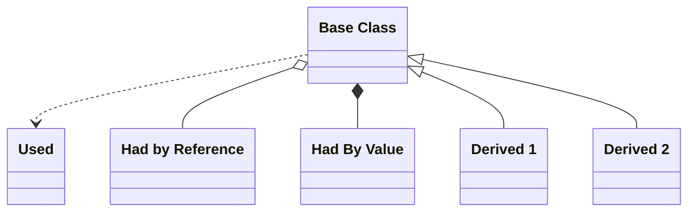

*A UML class diagram sidebar showing a Base Class with a dashed dependency to 'Used', aggregation to 'Had by Reference', composition to 'Had By Value', and inheritance to Derived 1 and Derived 2.*

<details>
<summary>Original figure</summary>

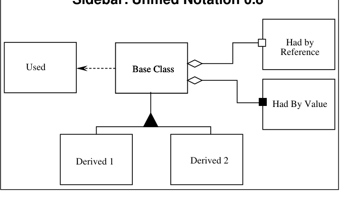

*Sidebar: Unified Notation 0.8*

<details>
<summary>Image description</summary>

Sidebar: Unified Notation 0.8 — UML diagram showing a Base Class with a dashed dependency arrow to Used, aggregation diamonds to Had by Reference and Had By Value, and a generalization triangle to Derived 1 and Derived 2

</details>
</details>

## Introduction

In my last column (May 96) I discussed the principle of Dependency Inversion (DIP). This principle states that modules that encapsulate high level policy should not depend upon modules that implement details. Rather, both kinds of modules should depend upon abstractions. To be more succinct and simplistic, abstract classes should not depend upon concrete classes; concrete classes should depend upon abstract classes. A good example of this principle is the TEMPLATE METHOD pattern from the GOF¹ book. In this pattern, a high level algorithm is encoded in an abstract base class and makes use of pure virtual functions to implement its details. Derived classes implement those detailed virtual functions. Thus, the class containing the details depend upon the class containing the abstraction.

In this article we will examine yet another structural principle: the Interface Segregation Principle (ISP). This principle deals with the disadvantages of "fat" interfaces. Classes that have "fat" interfaces are classes whose interfaces are not cohesive. In other

1. *Design Patterns*, Gamma, et. al. Addison Wesley, 1995

words, the interfaces of the class can be broken up into groups of member functions. Each group serves a different set of clients. Thus some clients use one group of member functions, and other clients use the other groups.

The ISP acknowledges that there are objects that require non-cohesive interfaces; however it suggests that clients should not know about them as a single class. Instead, clients should know about abstract base classes that have cohesive interfaces. Some languages refer to these abstract base classes as "interfaces", "protocols" or "signatures".

In this article we will discuss the disadvantages of "fat" or "polluted" interfaces. We will show how these interfaces get created, and how to design classes which hide them. Finally we will present a case study in which the a "fat" interface naturally occurs, and we will employ the ISP to correct it.

# Interface Pollution

Consider a security system. In this system there are Door objects that can be locked and unlocked, and which know whether they are open or closed. (See Listing 1).

Listing 1
Security Door

```cpp
class Door
{
  public:
    virtual void Lock()    = 0;
    virtual void Unlock()  = 0;
    virtual bool IsDoorOpen() = 0;
};
```

This class is abstract so that clients can use objects that conform to the Door interface, without having to depend upon particular implementations of Door.

Now consider that one such implementation. TimedDoor needs to sound an alarm when the door has been left open for too long. In order to do this the TimedDoor object communicates with another object called a Timer. (See Listing 2.)

Listing 2
Timer

```cpp
class Timer
{
  public:
    void Regsiter(int timeout, TimerClient* client);
};

class TimerClient
{
  public:
    virtual void TimeOut() = 0;
};
```

When an object wishes to be informed about a timeout, it calls the Register function of the Timer. The arguments of this function are the time of the timeout, and a pointer to a TimerClient object whose TimeOut function will be called when the timeout expires.

How can we get the TimerClient class to communicate with the TimedDoor class so that the code in the TimedDoor can be notified of the timeout? There are several alternatives. Figure 1 shows a common solution. We force Door, and therefore TimedDoor, to inherit from TimerClient. This ensures that TimerClient can register itself with the Timer and receive the TimeOut message.

Figure 1
TimerClient at top of hierarchy

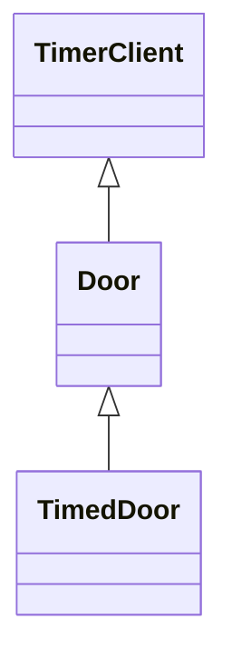

*UML class diagram (Figure 1) showing TimedDoor inheriting from Door, which inherits from TimerClient, placing TimerClient at the top of the hierarchy.*

<details>
<summary>Original figure</summary>

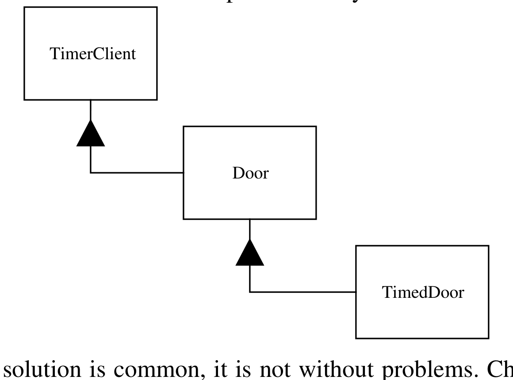

*Figure 1 TimerClient at top of hierarchy*

</details>

Although this solution is common, it is not without problems. Chief among these is that the Door class now depends upon TimerClient. Not all varieties of Door need timing. Indeed, the original Door abstraction had nothing whatever to do with timing. If timing-free derivatives of Door are created, those derivatives will have to provide nil implementations for the TimeOut method. Moreover, the applications that use those derivatives will have to #include the definition of the TimerClient class, even though it is not used.

Figure 1 shows a common syndrome of object oriented design in statically typed languages like C++. This is the syndrome of interface pollution. The interface of Door has been polluted with an interface that it does not require. It has been forced to incorporate this interface solely for the benefit of one of its subclasses. If this practice is pursued, then every time a derivative needs a new interface, that interface will be added to the base class. This will further pollute the interface of the base class, making it “fat”.

Moreover, each time a new interface is added to the base class, that interface must be implemented (or allowed to default) in derived classes. Indeed, an associated practice is to add these interfaces to the base class as *nil* virtual functions rather than pure virtual functions; specifically so that derived classes are not burdened with the need to implement them. As we learned in the second article of this column, such a practice violates the Liskov Substitution Principle (LSP), leading to maintenance and reusability problems.

# Separate Clients mean Separate Interfaces.

Door and TimerClient represent interfaces that are used by completly different clients. Timer uses TimerClient, and classes that manipulate doors use Door. Since the clients are separate, the interfaces should remain separate too. Why? Because, as we will see in the next section, clients exert forces upon their server interfaces.

# The backwards force applied by clients upon interfaces.

When we think of forces that cause changes in software, we normally think about how changes to interfaces will affect their users. For example, we would be concerned about the changes to all the users of TimerClient, if the TimerClient interface changed. However, there is a force that operates in the other direction. That is, sometimes it is the user that forces a change to the interface.

For example, some users of Timer will register more than one timeout request. Consider the TimedDoor. When it detects that the Door has been opened, it sends the Register message to the Timer, requesting a timeout. However, before that timeout expires the door closes; remains closed for awhile, and then opens again. This causes us to register a *new* timeout request before the old one has expired. Finally, the first timeout request expires and the TimeOut function of the TimedDoor is invoked. And the Door alarms falsely.

We can correct this situation by using the convention shown in Listing 3. We include a unique timeOutId code in each timeout registration, and repeat that code in the TimeOut call to the TimerClient. This allows each derivative of TimerClient to know which timeout request is being responded to.

**Listing 3**
Timer with ID

```cpp
class Timer
{
  public:
    void Regsiter(int timeout,
                  int timeOutId,
                  TimerClient* client);
};

class TimerClient
{
  public:
    virtual void TimeOut(int timeOutId) = 0;
};
```

Clearly this change will affect all the users of TimerClient. We accept this since the lack of the timeOutId is an oversight that needs correction. However, the design in Figure 1 will also cause Door, and all clients of Door to be affected (i.e. at least recompiled) by this fix! Why should a bug in TimerClient have *any* affect on clients of Door derivatives that do not require timing? It is this kind of strange interdependency that chills customers

and managers to the bone. When a change in one part of the program affects other completely unrelated parts of the program, the cost and repercussions of changes become unpredictable; and the risk of fallout from the change increases dramatically.

**But it's just a recompile.**

True. But recompiles can be very expensive for a number of reasons. First of all, they take time. When recompiles take too much time, developers begin to take shortcuts. They may hack a change in the "wrong" place, rather than engineer a change in the "right" place; because the "right" place will force a huge recompilation. Secondly, a recompilation means a new object module. In this day and age of dynamically linked libraries and incremental loaders, generating more object modules than necessary can be a significant disadvantage. The more DLLs that are affected by a change, the greater the problem of distributing and managing the change.

# The Interface Segregation Principle (ISP)

*CLIENTS SHOULD NOT BE FORCED TO DEPEND UPON INTERFACES THAT THEY DO NOT USE.*

When clients are forced to depend upon interfaces that they don't use, then those clients are subject to changes to those interfaces. This results in an inadvertent coupling between all the clients. Said another way, when a client depends upon a class that contains interfaces that the client does not use, but that other clients *do* use, then that client will be affected by the changes that those other clients force upon the class. We would like to avoid such couplings where possible, and so we want to separate the interfaces where possible.

# Class Interfaces vs Object Interfaces

Consider the TimedDoor again. Here is an object which has two separate interfaces used by two separate clients; Timer, and the users of Door. These two interfaces *must* be implemented in the same object since the implementation of both interfaces manipulates the same data. So how can we conform to the ISP? How can we separate the interfaces when they must remain together?

The answer to this lies in the fact that clients of an object do not need to access it through the interface of the object. Rather, they can access it through delegation, or through a base class of the object.

# Separation through Delegation

We can employ the *object form* of the ADAPTER⁠$^2$ pattern to the TimedDoor problem. The solution is to create an adapter object that derives from TimerClient and delegates to the TimedDoor. Figure 2 shows this solution.

When the TimedDoor wants to register a timeout request with the Timer, it creates a DoorTimerAdapter and registers it with the Timer. When the Timer sends the TimeOut message to the DoorTimerAdapter, the DoorTimerAdapter delegates the message back to the TimedDoor.

Figure 2
Door Timer Adapter

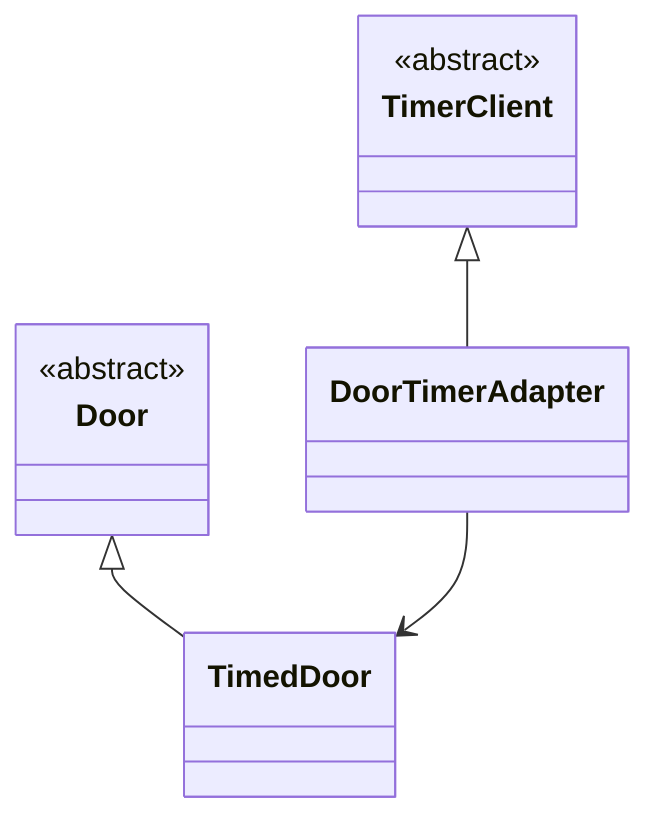

*UML class diagram (Figure 2): abstract classes Door and TimerClient each specialized by TimedDoor and DoorTimerAdapter respectively, with an association from DoorTimerAdapter to TimedDoor (adapter delegates to TimedDoor).*

<details>
<summary>Original figure</summary>

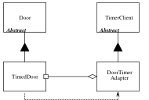

*Figure 2: Door Timer Adapter*

<details>
<summary>Image description</summary>

UML diagram: Door and TimerClient abstract classes at top; TimedDoor inherits from Door, DoorTimerAdapter inherits from TimerClient, and DoorTimerAdapter delegates to TimedDoor

</details>
</details>

This solution conforms to the ISP and prevents the coupling of Door clients to Timer. Even if the change to Timer shown in Listing 3 were to be made, none of the users of Door would be affected. Moreover, TimedDoor does not have to have the exact same interface as TimerClient. The DoorTimerAdapter can *translate* the TimerClient interface into the TimedDoor interface. Thus, this is a very general purpose solution. (See Listing 4)

**Listing 4**
Object Form of Adapter Pattern

```cpp
class TimedDoor : public Door
{
  public:
    virtual void DoorTimeOut(int timeOutId);
};

class DoorTimerAdapter : public TimerClient
{
  public:
      DoorTimerAdapter(TimedDoor& theDoor)
      :itsTimedDoor(theDoor)
      {}

      virtual void TimeOut(int timeOutId)
      {itsTimedDoor.DoorTimeOut(timeOutId);}
```

2. Another GOF pattern. ibid.

```cpp
private:
    TimedDoor& itsTimedDoor;
};
```

However, this solution is also somewhat inelegant. It involves the creation of a new object every time we wish to register a timeout. Moreover the delegation requires a very small, but still non-zero, amount of runtime and memory. There are application domains, such as embedded real time control systems, in which runtime and memory are scarce enough to make this a concern.

# Separation through Multiple Inheritance

Figure 3 and Listing 5 show how Multiple Inheritance can be used, in the *class form* of the ADAPTER pattern, to achieve the ISP. In this model, TimedDoor inherits from both Door and TimerClient. Although clients of both base classes can make use of TimedDoor, neither actually depend upon the TimedDoor class. Thus, they use the same object through separate interfaces.

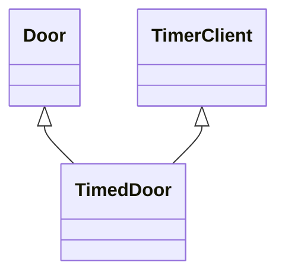

*UML class diagram showing TimedDoor multiply inheriting from both Door and TimerClient (Figure 3: Multiply Inherited Timed Door).*

<details>
<summary>Original figure</summary>

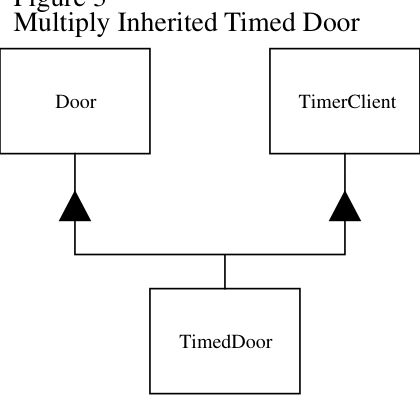

*Figure 3 — Multiply Inherited Timed Door*

</details>
Figure 3
Multiply Inherited Timed Door

**Listing 5**
Class Form of Adapter Pattern

```cpp
class TimedDoor : public Door, public TimerClient
{
  public:
    virtual void TimeOut(int timeOutId);
};
```

This solution is my normal preference. Multiple Inheritance does not frighten me. Indeed, I find it quite useful in cases such as this. The only time I would choose the solution in Figure 2 over Figure 3 is if the translation performed by the DoorTimerAdapter object were necessary, or if different translations were needed at different times.

# The ATM User Interface Example

Now let's consider a slightly more significant example. The traditional Automated Teller Machine (ATM) problem. The user interface of an ATM machine needs to be very flexible. The output may need to be translated into many different language. It may need to be presented on a screen, or on a braille tablet, or spoken out a speech synthesizer. Clearly this can be achieved by creating an abstract base class that has pure virtual functions for all the different messages that need to be presented by the interface.

Figure 4
ATM UI Hierarchy

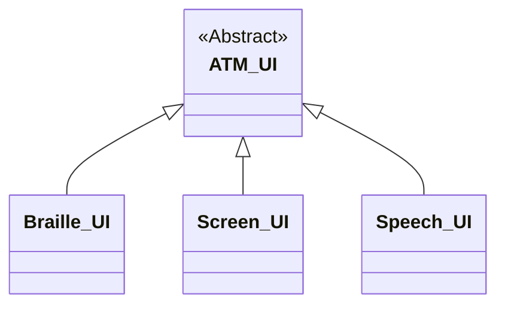

*UML class hierarchy (Figure 4, ATM UI Hierarchy) showing abstract class ATM UI with three subclasses Braille UI, Screen UI, and Speech UI inheriting from it.*

<details>
<summary>Original figure</summary>

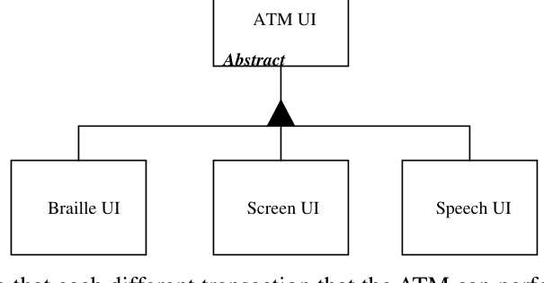

*Figure 4: ATM UI Hierarchy*

</details>

Consider also that each different transaction that the ATM can perform is encasulated as a derivative of the class Transaction. Thus we might have classes such as DepositTransaction, WithdrawlTransaction, TransferTransaction, etc. Each of these objects issues message to the UI. For example, the DepositTransaction object calls the RequestDepositAmount member function of the UI class. Whereas the TransferTransaction object calls the RequestTransferAmount member function of UI. This corresponds to the diagram in Figure 5.

Notice that this is precisely the situation that the ISP tells us to avoid. Each of the transactions is using a portion of the UI that no other object uses. This creates the possibility that changes to one of the derivatives of Transaction will force coresponding change to the UI, thereby affecting all the other derivatives of Transaction, and every other class that depends upon the UI interface.

This unfortunate coupling can be avoided by segregating the UI interface into induvidual abstract base classes such as DepositUI, WithdrawUI and TransferUI. These abstract base classes can then be multiply inherited into the final UI abstract class. Figure 6 and Listing 6 show this model.

It is true that, whenever a new derivative of the Transaction class is created, a corresponding base class for the abstract UI class will be needed. Thus the UI class and all its derivatives must change. However, these classes are not widely used. Indeed, they are probably only used by main, or whatever process boots the system and creates the concrete UI instance. So the impact of adding new UI base classes is contained.

Figure 5
ATM Transaction Hierarchy

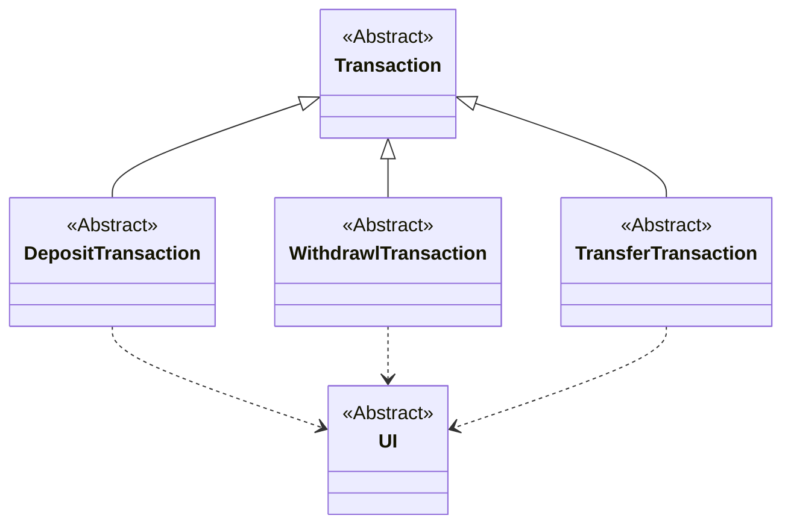

*UML class diagram (Figure 6, Segregated ATM UI Interface) showing abstract Transaction specialized by Deposit, Withdrawl, and Transfer Transactions, each depending on the abstract UI interface.*

<details>
<summary>Original figure</summary>

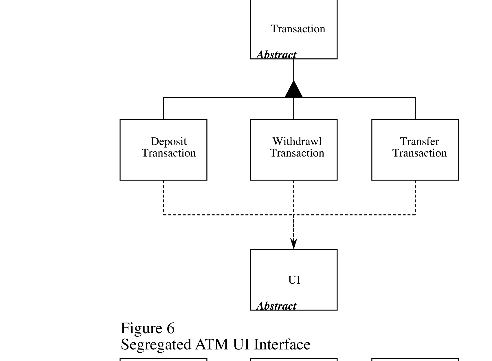

*Figure 5 ATM Transaction Hierarchy*

<details>
<summary>Image description</summary>

Figure 5: ATM Transaction Hierarchy diagram showing Transaction abstract class with Deposit, Withdrawl, and Transfer Transaction derivatives depending on abstract UI class

</details>
</details>

Figure 6
Segregated ATM UI Interface

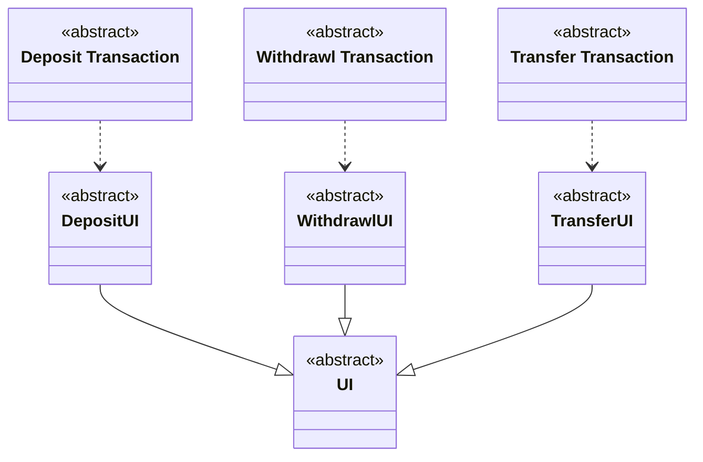

*UML class diagram (Figure 6) showing three abstract UI interfaces (DepositUI, WithdrawlUI, TransferUI) inheriting from an abstract UI class, each used by its corresponding transaction class via dashed dependency arrows.*

<details>
<summary>Original figure</summary>

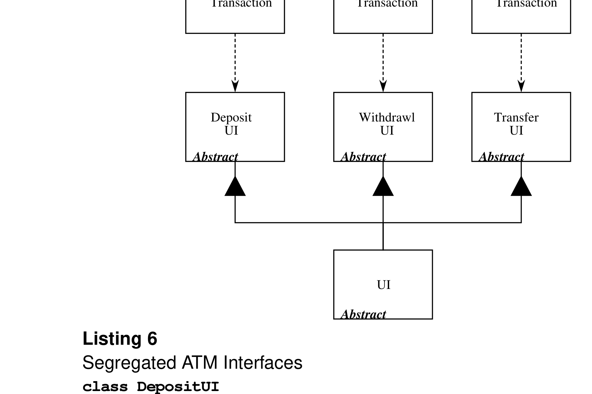

*Figure 6 Segregated ATM UI Interface*

<details>
<summary>Image description</summary>

Figure 6: Segregated ATM UI Interface diagram showing transaction classes depending on segregated Deposit UI, Withdrawl UI, Transfer UI abstract classes multiply inherited into abstract UI class

</details>
</details>

**Listing 6**
Segregated ATM Interfaces

```cpp
class DepositUI
{
  public:
    virtual void RequestDepositAmount() = 0;
};
```

```cpp
class DepositTransaction : public Transaction
{
  public:
    DepositTransaction(DepositUI& ui)
    : itsDepositUI(ui)
    {}

    virtual void Execute()
    {
      ...
      itsDepositUI.RequestDepositAmount();
      ...
    }
  private:
    DepositUI& itsDepositUI;
};

class WithdrawlUI
{
  public:
    virtual void RequestWithdrawlAmount() = 0;
};

class WithdrawlTransaction : public Transaction
{
  public:
    WithdrawlTransaction(WithdrawlUI& ui)
    : itsWithdrawlUI(ui)
    {}

    virtual void Execute()
    {
      ...
      itsWithdrawlUI.RequestWithdrawlAmount();
      ...
    }
  private:
    WithdrawlUI& itsWithdrawlUI;
};

class TransferUI
{
  public:
    virtual void RequestTransferAmount() = 0;
};

class TransferTransaction : public Transaction
{
  public:
    TransferTransaction(TransferUI& ui)
    : itsTransferUI(ui)
    {}

    virtual void Execute()
    {
      ...
      itsTransferUI.RequestTransferAmount();
      ...
    }
  private:
    TransferUI& itsTransferUI;
};

class UI : public DepositUI,
```

, public WithdrawlUI,
, public TransferUI
{
public:
virtual void RequestDepositAmount();
virtual void RequestWithdrawlAmount();
virtual void RequestTransferAmount();
};

A careful examination of Listing 6 will show one of the issues with ISP conformance that was not obvious from the TimedDoor example. Note that each transaction must somehow know about its particular version of the UI. DepositTransaction must know about DepositUI; WithdrawTransaction must know about WithdrawUI, etc. In Listing 6 I have addressed this issue by forcing each transaction to be constructed with a reference to its particular UI. Note that this allows me to employ the idiom in Listing 7.

**Listing 7**
Interface Initialization Idiom

```cpp
UI Gui; // global object;

void f()
{
    DepositTransaction dt(Gui);
}
```

This is handy, but also forces each transaction to contain a reference member to its UI. Another way to address this issue is to create a set of global constants as shown in Listing 8. As we discovered when we discussed the Open Closed Principle in the January 96 issue, global variables are not always a symptom of a poor design. In this case they provide the distinct advantage of easy access. And since they are references, it is impossible to change them in any way, therefore they cannot be manipulated in a way that would surprise other users.

**Listing 8**
Seperate Global Pointers

```cpp
// in some module that gets linked in
// to the rest of the app.

static UI Lui; // non-global object;
DepositUI&   GdepositUI   = Lui;
WithdrawlUI& GwithdrawlUI = Lui;
TransferUI&  GtransferUI  = Lui;

// In the depositTransaction.h module

class class WithdrawlTransation : public Transaction
{
  public:

    virtual void Execute()
    {
      ...
    }
}
```

```cpp
      GwithdrawlUI.RequestWithdrawlAmount();
      ...
    }
  };
```

One might be tempted to put all the globals in Listing 8 into a single class in order to prevent pollution of the global namespace. Listing 9 shows such an approach. This, however, has an unfortunate effect. In order to use UIGlobals, you must `#include ui_globals.h`. This, in turn, `#include`s depositUI.h, withdrawUI.h, and transferUI.h. This means that any module wishing to use any of the UI interfaces transitively depends upon all of them; exactly the situation that the ISP warns us to avoid. If a change is made to any of the UI interfaces, all modules that `#include ui_globals.h` are forced to recompile. The UIGlobals class has recombined the interfaces that we had worked so hard to segregate!

**Listing 9**
Wrapping the Globals in a class

```cpp
// in ui_globals.h

#include "depositUI.h"
#include "withdrawlUI.h"
#include "transferUI.h"

class UIGlobals
{
  public:
    static WithdrawlUI& withdrawl;
    static DepositUI&   deposit;
    static TransferUI&  transfer
};

// in ui_globals.cc

static UI Lui; // non-global object;
DepositUI&   UIGlobals::deposit   = Lui;
WithdrawlUI& UIGlobals::withdrawl = Lui;
TransferUI&  UIGlobals::transfer  = Lui;
```

## The Polyad vs. the Monad.

Consider a function 'g' that needs access to both the DepositUI and the TransferUI. Consider also that we wish to pass the UIs into this function. Should we write the function prototype like this: `void g(DepositUI&, TransferUI&);`? Or should we write it like this: `void g(UI&);`?

The temptation to write the latter (monadic) form is strong. After all, we know that in the former (polyadic) form, both arguments will refer to the *same object*. Moreover, if we were to use the polyadic form, its invocation would look like this: `g(ui, ui);` Somehow this seems perverse.

Perverse or not, the polyadic form is preferable to the monadic form. The monadic form forces 'g' to depend upon every interface included in UI. Thus, when WithdrawUI

changed, ‘g’ and all clients of ‘g’ would have to recompile. This is more perverse than `g(ui,ui);`! Moreover, we cannot be sure that both arguments of ‘g’ will *always* refer to the same object! In the future, it may be that the interface objects are separated for some reason. From the point of view of function ‘g’, the fact that all interfaces are combined into a single object is information that ‘g’ does not need to know. Thus, I prefer the polyadic form for such functions.

# Conclusion

In this article we have discussed the disadvantages of “fat interfaces”; i.e. interfaces that are not specific to a single client. Fat interfaces lead to inadvertent couplings between clients that ought otherwise to be isolated. By making use of the ADAPTER pattern, either through delegation (object form) or multiple inheritance (class form), fat interfaces can be segregated into abstract base classes that break the unwanted coupling between clients.

This article is an extremely condensed version of a chapter from my new book: *Patterns and Advanced Principles of OOD*, to be published soon by Prentice Hall. In subsequent articles we will explore many of the other principles of object oriented design. We will also study various design patterns, and their strengths and weaknesses with regard to implementation in C++. We will study the role of Booch’s class categories in C++, and their applicability as C++ namespaces. We will define what “cohesion” and “coupling” mean in an object oriented design, and we will develop metrics for measuring the quality of an object oriented design. And after that, we will discuss many other interesting topics.
