# The Open-Closed Principle

## Table of Contents

- [Description](#description)
- [Abstraction is the Key.](#abstraction-is-the-key)
- [The Shape Abstraction](#the-shape-abstraction)
  - [The Shape Abstraction](#the-shape-abstraction)
- [Strategic Closure](#strategic-closure)
  - [Using Abstraction to Gain Explicit Closure.](#using-abstraction-to-gain-explicit-closure)
  - [Using a "Data Driven" Approach to Achieve Closure.](#using-a-data-driven-approach-to-achieve-closure)
  - [Extending Closure Even Further.](#extending-closure-even-further)
- [Heuristics and Conventions](#heuristics-and-conventions)
  - [Make all Member Variables Private.](#make-all-member-variables-private)
  - [No Global Variables -- Ever.](#no-global-variables----ever)
  - [RTTI is Dangerous.](#rtti-is-dangerous)
- [Conclusion](#conclusion)

This is the first of my *Engineering Notebook* columns for *The C++ Report*. The articles that will appear in this column will focus on the use of C++ and OOD, and will address issues of software engineering. I will strive for articles that are pragmatic and directly useful to the software engineer in the trenches. In these articles I will make use of Booch's notation for documenting object oriented designs. The sidebar provides a brief lexicon of Booch's notation.

There are many heuristics associated with object oriented design. For example, "all member variables should be private", or "global variables should be avoided", or "using run time type identification (RTTI) is dangerous". What is the source of these heuristics? What makes them true? Are they *always* true? This column investigates the design principle that underlies these heuristics -- the open-closed principle.

As Ivar Jacobson said: "All systems change during their life cycles. This must be borne in mind when developing systems expected to last longer than the first version."¹ How can we create designs that are stable in the face of change and that will last longer than the first version? Bertrand Meyer² gave us guidance as long ago as 1988 when he coined the now famous open-closed principle. To paraphrase him:

> *SOFTWARE ENTITIES (CLASSES, MODULES, FUNCTIONS, ETC.) SHOULD BE OPEN FOR EXTENSION, BUT CLOSED FOR MODIFICATION.*

When a single change to a program results in a cascade of changes to dependent modules, that program exhibits the undesirable attributes that we have come to associate with "bad" design. The program becomes fragile, rigid, unpredictable and unreusable. The open-closed principle attacks this in a very straightforward way. It says that you should design modules that *never change*. When requirements change, you extend the behavior of such modules by adding new code, not by changing old code that already works.

# Description

Modules that conform to the open-closed principle have two primary attributes.

______________________________________________________________________

1. Object Oriented Software Engineering a Use Case Driven Approach, Ivar Jacobson, Addison Wesley, 1992, p 21.

1. Object Oriented Software Construction, Bertrand Meyer, Prentice Hall, 1988, p 23

1. They are “Open For Extension”.

   This means that the behavior of the module can be extended. That we can make the module behave in new and different ways as the requirements of the application change, or to meet the needs of new applications.

1. They are “Closed for Modification”.

   The source code of such a module is inviolate. No one is allowed to make source code changes to it.

It would seem that these two attributes are at odds with each other. The normal way to extend the behavior of a module is to make changes to that module. A module that cannot be changed is normally thought to have a fixed behavior. How can these two opposing attributes be resolved?

# Abstraction is the Key.

In C++, using the principles of object oriented design, it is possible to create abstractions that are fixed and yet represent an unbounded group of possible behaviors. The abstractions are abstract base classes, and the unbounded group of possible behaviors is represented by all the possible derivative classes. It is possible for a module to manipulate an abstraction. Such a module can be closed for modification since it depends upon an abstraction that is fixed. Yet the behavior of that module can be extended by creating new derivatives of the abstraction.

Figure 1 shows a simple design that does not conform to the open-closed principle. Both the `Client` and `Server` classes are concrete. There is no guarantee that the member functions of the `Server` class are virtual. The `Client` class *uses* the `Server` class. If we wish for a `Client` object to use a different server object, then the `Client` class must be changed to name the new server class.

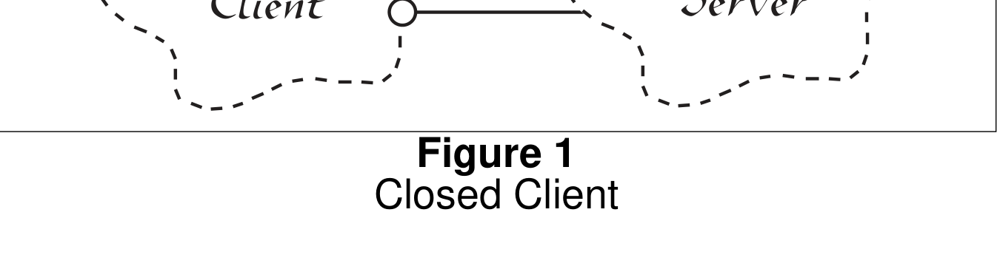

*Figure 1 Closed Client*

**Figure 1**
Closed Client

Figure 2 shows the corresponding design that conforms to the open-closed principle. In this case, the `AbstractServer` class is an abstract class with pure-virtual member functions. the `Client` class uses this abstraction. However objects of the `Client` class will be using objects of the derivative `Server` class. If we want `Client` objects to use a different server class, then a new derivative of the `AbstractServer` class can be created. The `Client` class can remain unchanged.

# The Shape Abstraction

Consider the following example. We have an application that must be able to draw circles and squares on a standard GUI. The circles and squares must be drawn in a particular order. A list of the circles and squares will be created in the appropriate order and the program must walk the list in that order and draw each circle or square.

In C, using procedural techniques that do not conform to the open-closed principle, we might solve this problem as shown in Listing 1. Here we see a set of data structures that have the same first element, but are different beyond that. The first element of each is a type code that identifies the data structure as either a circle or a square. The function `DrawAllShapes` walks an array of pointers to these data structures, examining the type code and then calling the appropriate function (either `DrawCircle` or `DrawSquare`).

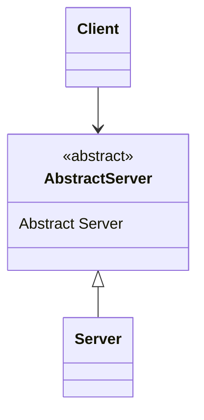

*A UML class diagram where a Client associates with an abstract Abstract Server class (marked with an 'A' flag), and a concrete Server class inherits from Abstract Server.*

<details>
<summary>Original figure</summary>

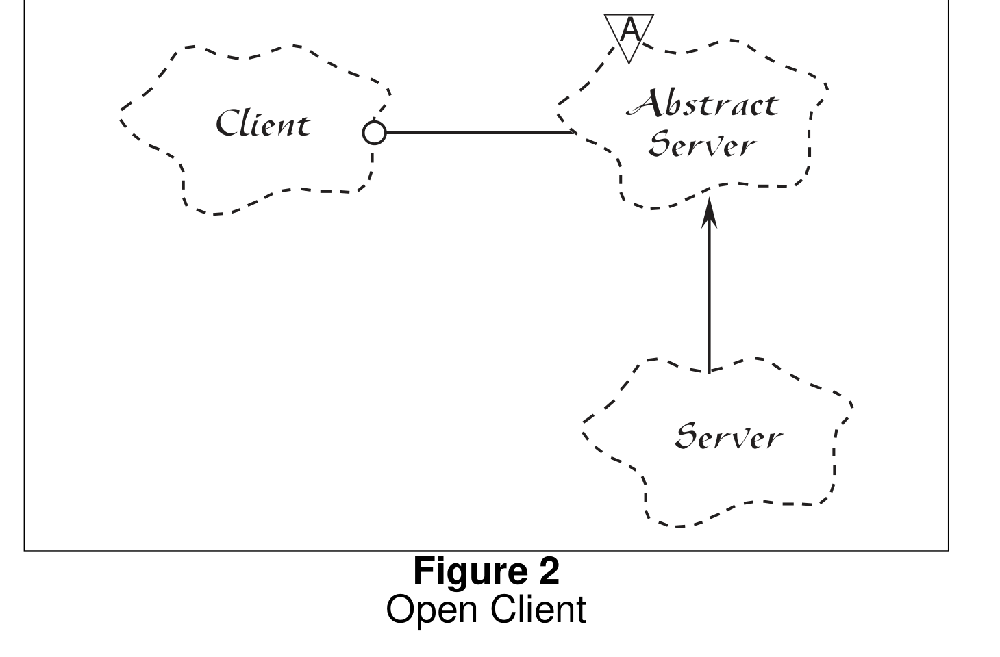

*Figure 2
Open Client*

</details>

**Figure 2**
Open Client

Listing 1: Procedural Solution to the Square/Circle Problem

```c
enum ShapeType {circle, square};

struct Shape
{
  ShapeType itsType;
};

struct Circle
{
  ShapeType itsType;
  double itsRadius;
  Point itsCenter;
};
```

## The Shape Abstraction

Listing 1 (Continued)
Procedural Solution to the Square/Circle Problem

```c
struct Square
{
  ShapeType itsType;
  double itsSide;
  Point itsTopLeft;
};

//
// These functions are implemented elsewhere
//
void DrawSquare(struct Square*)
void DrawCircle(struct Circle*);

typedef struct Shape *ShapePointer;

void DrawAllShapes(ShapePointer list[], int n)
{
  int i;
  for (i=0; i<n; i++)
  {
    struct Shape* s = list[i];
    switch (s->itsType)
    {
    case square:
      DrawSquare((struct Square*)s);
    break;

    case circle:
      DrawCircle((struct Circle*)s);
    break;
    }
  }
}
```

The function `DrawAllShapes` does not conform to the open-closed principle because it cannot be closed against new kinds of shapes. If I wanted to extend this function to be able to draw a list of shapes that included triangles, I would have to modify the function. In fact, I would have to modify the function for any new type of shape that I needed to draw.

Of course this program is only a simple example. In real life the `switch` statement in the `DrawAllShapes` function would be repeated over and over again in various functions all over the application; each one doing something a little different. Adding a new shape to such an application means hunting for every place that such `switch` statements (or `if/else` chains) exist, and adding the new shape to each. Moreover, it is very unlikely that all the `switch` statements and `if/else` chains would be as nicely structured as the one in `DrawAllShapes`. It is much more likely that the predicates of the `if`

statements would be combined with logical operators, or that the `case` clauses of the `switch` statements would be combined so as to "simplify" the local decision making. Thus the problem of finding and understanding all the places where the new shape needs to be added can be non-trivial.

Listing 2 shows the code for a solution to the square/circle problem that conforms to the open-closed principle. In this case an abstract `Shape` class is created. This abstract class has a single pure-virtual function called `Draw`. Both `Circle` and `Square` are derivatives of the `Shape` class.

**Listing 2**
OOD solution to Square/Circle problem.

```cpp
class Shape
{
  public:
    virtual void Draw() const = 0;
};

class Square : public Shape
{
  public:
    virtual void Draw() const;
};

class Circle : public Shape
{
  public:
    virtual void Draw() const;
};

void DrawAllShapes(Set<Shape*>& list)
{
  for (Iterator<Shape*>i(list); i; i++)
     (*i)->Draw();
}
```

Note that if we want to extend the behavior of the `DrawAllShapes` function in Listing 2 to draw a new kind of shape, all we need do is add a new derivative of the `Shape` class. The `DrawAllShapes` function does not need to change. Thus `DrawAllShapes` conforms to the open-closed principle. Its behavior can be extended without modifying it.

In the real world the `Shape` class would have many more methods. Yet adding a new shape to the application is still quite simple since all that is required is to create the new derivative and implement all its functions. There is no need to hunt through all of the application looking for places that require changes.

Since programs that conform to the open-closed principle are changed by adding new code, rather than by changing existing code, they do not experience the cascade of changes exhibited by non-conforming programs.

# Strategic Closure

It should be clear that no significant program can be 100% closed. For example, consider what would happen to the `DrawAllShapes` function from Listing 2 if we decided that all `Circles` should be drawn before any `Squares`. The `DrawAllShapes` function is not closed against a change like this. In general, no matter how "closed" a module is, there will always be some kind of change against which it is not closed.

Since closure cannot be complete, it must be strategic. That is, the designer must choose the kinds of changes against which to close his design. This takes a certain amount of prescience derived from experience. The experienced designer knows the users and the industry well enough to judge the probability of different kinds of changes. He then makes sure that the open-closed principle is invoked for the most probable changes.

## Using Abstraction to Gain Explicit Closure.

How could we close the `DrawAllShapes` function against changes in the ordering of drawing? Remember that closure is based upon abstraction. Thus, in order to close `DrawAllShapes` against ordering, we need some kind of "ordering abstraction". The specific case of ordering above had to do with drawing certain types of shapes before other types of shapes.

An ordering policy implies that, given any two objects, it is possible to discover which ought to be drawn first. Thus, we can define a method of `Shape` named `Precedes` that takes another `Shape` as an argument and returns a `bool` result. The result is `true` if the `Shape` object that receives the message should be ordered before the `Shape` object passed as the argument.

In C++ this function could be represented by an overloaded `operator<` function. Listing 3 shows what the `Shape` class might look like with the ordering methods in place.

Now that we have a way to determine the relative ordering of two `Shape` objects, we can sort them and then draw them in order. Listing 4 shows the C++ code that does this. This code uses the `Set`, `OrderedSet` and `Iterator` classes from the `Components` category developed in my book[^3] (if you would like a free copy of the source code of the `Components` category, send email to `rmartin@oma.com`).

This gives us a means for ordering `Shape` objects, and for drawing them in the appropriate order. But we still do not have a decent ordering abstraction. As it stands, the individual `Shape` objects will have to override the `Precedes` method in order to specify ordering. How would this work? What kind of code would we write in `Circle::Precedes` to ensure that `Circles` were drawn before `Squares`? Consider Listing 5.

\[^3\]: *Designing Object Oriented C++ Applications using the Booch Method*, Robert C. Martin, Prentice Hall, 1995.

**Listing 3**
Shape with ordering methods.

```cpp
class Shape
{
  public:
    virtual void Draw() const = 0;
    virtual bool Precedes(const Shape&) const = 0;

    bool operator<(const Shape& s) {return Precedes(s);}
};
```

**Listing 4**
DrawAllShapes with Ordering

```cpp
void DrawAllShapes(Set<Shape*>& list)
{
    // copy elements into OrderedSet and then sort.
    OrderedSet<Shape*> orderedList = list;
    orderedList.Sort();

    for (Iterator<Shape*> i(orderedList); i; i++)
        (*i)->Draw();
}
```

**Listing 5**
Ordering a Circle

```cpp
bool Circle::Precedes(const Shape& s) const
{
    if (dynamic_cast<Square*>(s))
        return true;
    else
        return false;
}
```

It should be very clear that this function does not conform to the open-closed principle. There is no way to close it against new derivatives of `Shape`. Every time a new derivative of `Shape` is created, this function will need to be changed.

## Using a "Data Driven" Approach to Achieve Closure.

Closure of the derivatives of `Shape` can be achieved by using a table driven approach that does not force changes in every derived class. Listing 6 shows one possibility.

By taking this approach we have successfully closed the `DrawAllShapes` function against ordering issues in general and each of the `Shape` derivatives against the creation of new `Shape` derivatives or a change in policy that reorders the `Shape` objects by their type. (e.g. Changing the ordering so that `Squares` are drawn first.)

**Listing 6**
Table driven type ordering mechanism

````cpp
#include <typeinfo.h>
#include <string.h>
enum {false, true};
typedef int bool;

class Shape
{
  public:
    virtual void Draw() const = 0;
    virtual bool Precedes(const Shape&) const;

    bool operator<(const Shape& s) const
    {return Precedes(s);}
  private:
    static char* typeOrderTable[];
};

char* Shape::typeOrderTable[] =
{
    "Circle",
    "Square",
    0
};

// This function searches a table for the class names.
// The table defines the order in which the
// shapes are to be drawn. Shapes that are not
// found always precede shapes that are found.
//
bool Shape::Precedes(const Shape& s) const
{
    const char* thisType = typeid(*this).name();
    const char* argType = typeid(s).name();
    bool done = false;
    int thisOrd = -1;
    int argOrd = -1;
    for (int i=0; !done; i++)
    {
        const char* tableEntry = typeOrderTable[i];
        if (tableEntry != 0)
        {
            if (strcmp(tableEntry, thisType) == 0)
                thisOrd = i;
            if (strcmp(tableEntry, argType) == 0)
                argOrd = i;

**Listing 6 (Continued)**
Table driven type ordering mechanism

```cpp
            if ((argOrd > 0) && (thisOrd > 0))
                done = true;
        }
        else // table entry == 0
            done = true;
    }
    return thisOrd < argOrd;
}
````

The only item that is not closed against the order of the various `Shape`s is the table itself. And that table can be placed in its own module, separate from all the other modules, so that changes to it do not affect any of the other modules.

## Extending Closure Even Further.

This isn't the end of the story. We have managed to close the `Shape` hierarchy, and the `DrawAllShapes` function against ordering that is dependent upon the type of the shape. However, the `Shape` derivatives are not closed against ordering policies that have nothing to do with shape types. It seems likely that we will want to order the drawing of shapes according to some higher level structure. A complete exploration of these issues is beyond the scope of this article; however the ambitious reader might consider how to address this issue using an abstract `OrderedObject` class contained by the class `OrderedShape`, which is derived from both `Shape` and `OrderedObject`.

# Heuristics and Conventions

As mentioned at the begining of this article, the open-closed principle is the root motivation behind many of the heuristics and conventions that have been published regarding OOD over the years. Here are some of the more important of them.

## Make all Member Variables Private.

This is one of the most commonly held of all the conventions of OOD. Member variables of classes should be known only to the methods of the class that defines them. Member variables should never be known to any other class, including derived classes. Thus they should be declared `private`, rather than `public` or `protected`.

In light of the open-closed principle, the reason for this convention ought to be clear. When the member variables of a class change, every function that depends upon those variables must be changed. Thus, no function that depends upon a variable can be closed with respect to that variable.

In OOD, we expect that the methods of a class are not closed to changes in the member variables of that class. However we *do* expect that any other class, including subclasses *are closed* against changes to those variables. We have a name for this expectation, we call it: *encapsulation*.

Now, what if you had a member variable that you knew would never change? Is there any reason to make it `private`? For example, Listing 7 shows a class `Device` that has a `bool status` variable. This variable contains the status of the last operation. If that operation succeeded, then `status` will be `true`; otherwise it will be `false`.

**Listing 7**
non-const public variable

```cpp
class Device
{
  public:
    bool status;
};
```

We know that the type or meaning of this variable is never going to change. So why not make it `public` and let client code simply examine its contents? If this variable really never changes, and if all other clients obey the rules and only query the contents of `status`, then the fact that the variable is `public` does no harm at all. However, consider what happens if even one client takes advantage of the writable nature of `status`, and changes its value. Suddenly, this one client could affect every other client of `Device`. This means that it is impossible to close any client of `Device` against changes to this one misbehaving module. This is probably far too big a risk to take.

On the other hand, suppose we have the `Time` class as shown in Listing 8. What is the harm done by the public member variables in this class? Certainly they are very unlikely to change. Moreover, it does not matter if any of the client modules make changes to the variables, the variables are supposed to be changed by clients. It is also very unlikely that a derived class might want to trap the setting of a particular member variable. So is any harm done?

**Listing 8**

```cpp
class Time
{
  public:
    int hours, minutes, seconds;
    Time& operator-=(int seconds);
    Time& operator+=(int seconds);
    bool  operator< (const Time&);
    bool  operator> (const Time&);
    bool  operator==(const Time&);
    bool  operator!=(const Time&);
};
```

One complaint I could make about Listing 8 is that the modification of the time is not atomic. That is, a client can change the `minutes` variable without changing the `hours` variable. This may result in inconsistent values for a `Time` object. I would prefer it if there were a single function to set the time that took three arguments, thus making the setting of the time atomic. But this is a very weak argument.

It would not be hard to think of other conditions for which the `public` nature of these variables causes some problems. In the long run, however, there is no *overriding* reason to make these variables `private`. I still consider it bad *style* to make them `public`, but it is probably not bad *design*. I consider it bad style because it is very cheap to create the appropriate inline member functions; and the cheap cost is almost certainly worth the protection against the slight risk that issues of closure will crop up.

Thus, in those rare cases where the open-closed principle is not violated, the proscription of `public` and `protected` variables depends more upon style than on substance.

## No Global Variables -- Ever.

The argument against global variables is similar to the argument against public member variables. No module that depends upon a global variable can be closed against any other module that might write to that variable. Any module that uses the variable in a way that the other modules don't expect, will break those other modules. It is too risky to have many modules be subject to the whim of one badly behaved one.

On the other hand, in cases where a global variable has very few dependents, or cannot be used in an inconsistent way, they do little harm. The designer must assess how much closure is sacrificed to a global and determine if the convenience offered by the global is worth the cost.

Again, there are issues of style that come into play. The alternatives to using globals are usually very inexpensive. In those cases it is bad style to use a technique that risks even a tiny amount of closure over one that does not carry such a risk. However, there are cases where the convenience of a global is significant. The global variables `cout` and `cin` are common examples. In such cases, if the open-closed principle is not violated, then the convenience may be worth the style violation.

## RTTI is Dangerous.

Another very common proscription is the one against `dynamic_cast`. It is often claimed that `dynamic_cast`, or any form of run time type identification (RTTI) is intrinsically dangerous and should be avoided. The case that is often cited is similar to Listing 9 which clearly violates the open-closed principle. However Listing 10 shows a similar program that uses `dynamic_cast`, but does not violate the open-closed principle.

The difference between these two is that the first, Listing 9, *must* be changed whenever a new type of `Shape` is derived. (Not to mention that it is just downright silly). How-

**Listing 9**
RTTI violating the open-closed principle.

```cpp
class Shape {};

class Square : public Shape
{
  private:
    Point  itsTopLeft;
    double itsSide;
  friend DrawSquare(Square*);
};

class Circle : public Shape
{
  private:
    Point  itsCenter;
    double itsRadius;
  friend DrawCircle(Circle*);
};

void DrawAllShapes(Set<Shape*>& ss)
{
    for (Iterator<Shape*>i(ss); i; i++)
    {
        Circle* c = dynamic_cast<Circle*>(*i);
        Square* s = dynamic_cast<Square*>(*i);
        if (c)
            DrawCircle(c);
        else if (s)
            DrawSquare(s);
    }
}
```

**Listing 10**
RTTI that does not violate the open-closed Principle.

```cpp
class Shape
{
  public:
    virtual void Draw() cont = 0;
};

class Square : public Shape
{
    // as expected.
};

void DrawSquaresOnly(Set<Shape*>& ss)
```

**Listing 10 (Continued)**
RTTI that does not violate the open-closed Principle.

```cpp
{
    for (Iterator<Shape*>i(ss); i; i++)
    {
        Square* s = dynamic_cast<Square*>(*i);
        if (s)
            s->Draw();
    }
}
```

ever, nothing changes in Listing 10 when a new derivative of `Shape` is created. Thus, Listing 10 does not violate the open-closed principle.

As a general rule of thumb, if a use of RTTI does not violate the open-closed principle, it is safe.

# Conclusion

There is much more that could be said about the open-closed principle. In many ways this principle is at the heart of object oriented design. Conformance to this principle is what yeilds the greatest benefits claimed for object oriented technology; i.e. reusability and maintainability. Yet conformance to this principle is not achieved simply by using an object oriented programming language. Rather, it requires a dedication on the part of the designer to apply abstraction to those parts of the program that the designer feels are going to be subject to change.

This article is an extremely condensed version of a chapter from my new book: *The Principles and Patterns of OOD*, to be published soon by Prentice Hall. In subsequent articles we will explore many of the other principles of object oriented design. We will also study various design patterns, and their strenghts and weaknesses with regard to implementation in C++. We will study the role of Booch's class categories in C++, and their applicability as C++ namespaces. We will define what "cohesion" and "coupling" mean in an object oriented design, and we will develop metrics for measuring the quality of an object oriented design. And, after that, many other interesting topics.

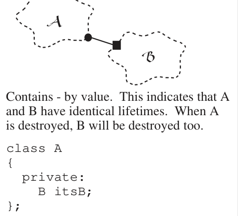

Contains - by value. This indicates that A and B have identical lifetimes. When A is destroyed, B will be destroyed too.

```cpp
class A
{
  private:
    B itsB;
};
```

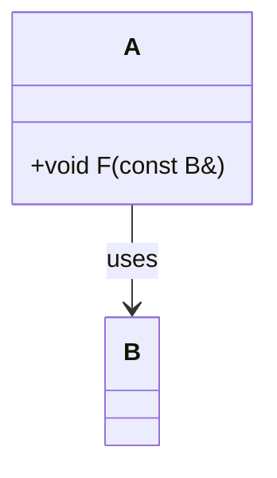

*A Booch-style cloud diagram showing that class A uses class B, illustrated with a code example where A has a method F taking a const B& parameter.*

<details>
<summary>Original figure</summary>

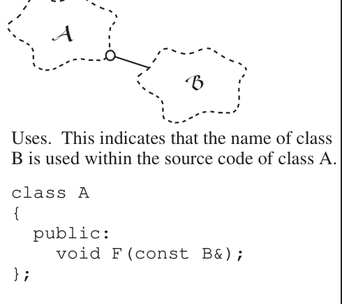

</details>

Uses. This indicates that the name of class B is used within the source code of class A.

```cpp
class A
{
  public:
    void F(const B&);
};
```

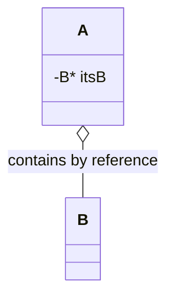

*A Booch-style UML notation figure showing class A containing class B by reference (pointer member B* itsB), indicating dissimilar lifetimes where B may outlive A.\*

<details>
<summary>Original figure</summary>

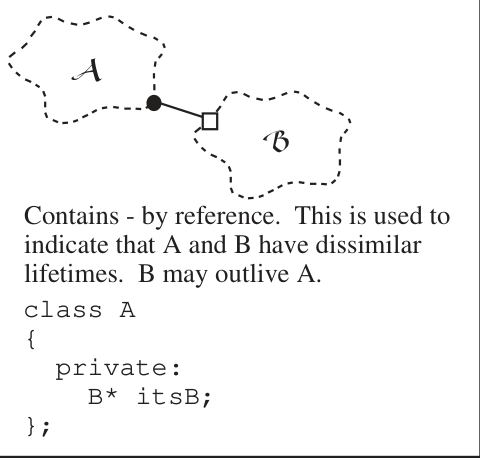

</details>

Contains - by reference. This is used to indicate that A and B have dissimilar lifetimes. B may outlive A.

```cpp
class A
{
  private:
    B* itsB;
};
```

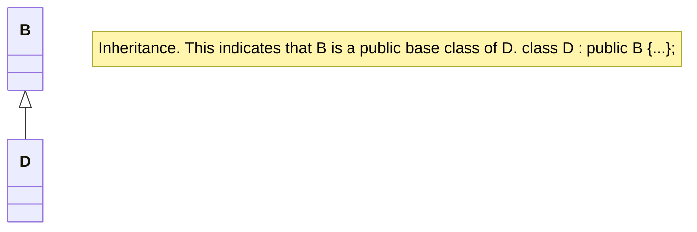

*An inheritance notation figure showing class D deriving publicly from base class B, with the C++ declaration 'class D : public B {...};'.*

<details>
<summary>Original figure</summary>

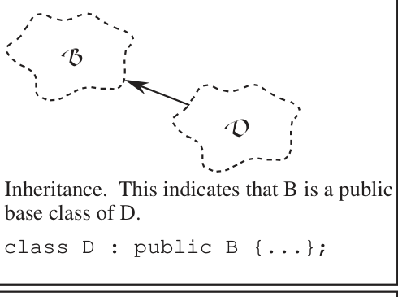

</details>

Inheritance. This indicates that B is a public base class of D.

```cpp
class D : public B {...};
```

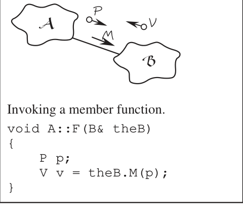

Invoking a member function.

```cpp
void A::F(B& theB)
{
    P p;
    V v = theB.M(p);
}
```

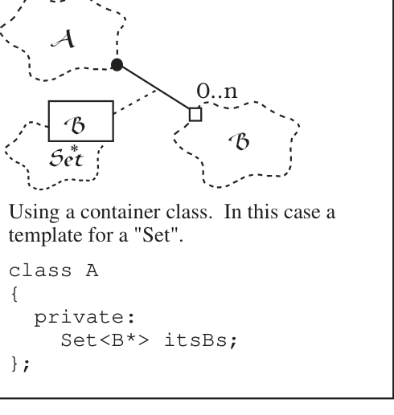

Using a container class. In this case a template for a "Set".

```cpp
class A
{
  private:
    Set<B*> itsBs;
};
```
