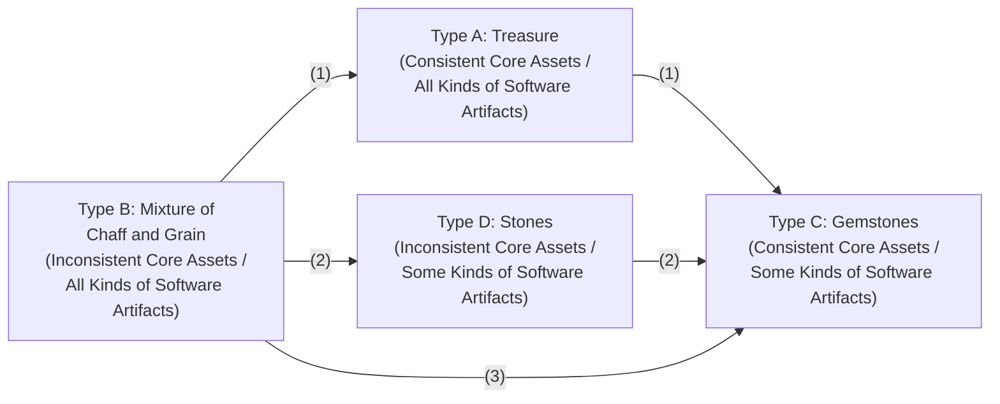
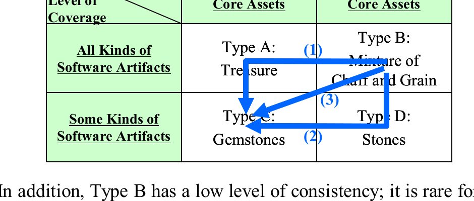
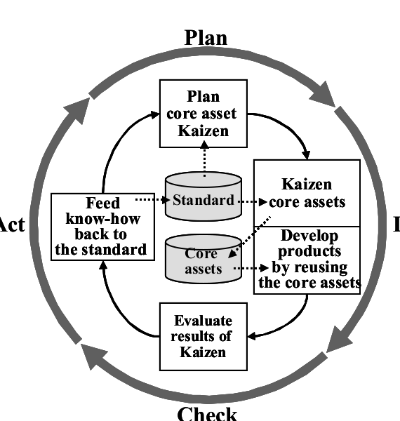
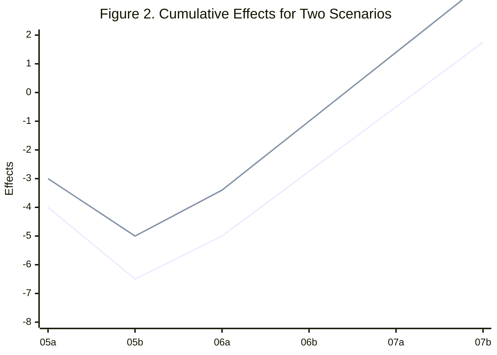
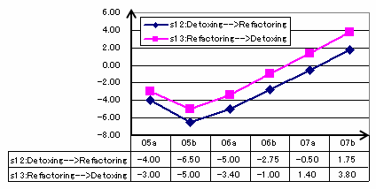
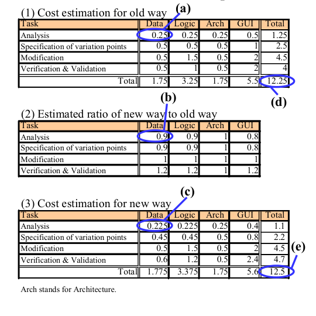

# Software Product Line Evolution Method Based on *Kaizen* Approach

## Table of Contents

- [ABSTRACT](#abstract)
- [Categories and Subject Descriptors](#categories-and-subject-descriptors)
- [General Terms](#general-terms)
- [Keywords](#keywords)
- [1. INTRODUCTION](#1-introduction)
  - [1.1 Product Line Engineering](#11-product-line-engineering)
  - [1.2 Core Asset Evolution and *Kaizen*](#12-core-asset-evolution-and-kaizen)
  - [1.3 Lack of Detailed Evolution Knowledge](#13-lack-of-detailed-evolution-knowledge)
  - [1.4 Research Approach](#14-research-approach)
- [2. METRICS & TYPES](#2-metrics-types)
  - [2.1 Level of Coverage](#21-level-of-coverage)
  - [2.2 Level of Consistency](#22-level-of-consistency)
  - [2.3 Types of Core Assets](#23-types-of-core-assets)
- [3. *KAIZEN* ACTIVITIES](#3-kaizen-activities)
  - [3.1 Harvesting Core Assets](#31-harvesting-core-assets)
  - [3.2 Detoxing Core Assets](#32-detoxing-core-assets)
  - [3.3 Refactoring Core Assets](#33-refactoring-core-assets)
- [4. *KAIZEN* KNOWLEDGE](#4-kaizen-knowledge)
  - [4.1 *Kaizen* Scenario](#41-kaizen-scenario)
  - [4.2 *Kaizen* Pattern](#42-kaizen-pattern)
- [5. *KAIZEN* PROCESS](#5-kaizen-process)
- [6. APPLICATION EXAMPLE](#6-application-example)
  - [6.1 Target Domain](#61-target-domain)
  - [6.2 Procedures for Defining *Kaizen* Plan](#62-procedures-for-defining-kaizen-plan)
  - [6.3 Procedures for Executing *Kaizen* Plan](#63-procedures-for-executing-kaizen-plan)
- [7. DISCUSSION](#7-discussion)
- [8. RELATED WORK](#8-related-work)
- [9. CONCLUSION and FUTURE WORK](#9-conclusion-and-future-work)
- [10. REFERENCES](#10-references)

Mari Inoki
Toshiba Solutions Corporation¹ and Waseda University
¹3-22 Katamachi, Fuchu-shi, Tokyo 183-8512, Japan
+81 42 340 6357
inoki.mari@toshiba-sol.co.jp

Yoshiaki Fukazawa
School of Science and Engineering
Waseda University
3-4-1 Okubo, Shinjuku-ku, Tokyo 169-8555, JAPAN
+81 3 5286 3345
fukazawa@waseda.jp

## ABSTRACT

Continuing optimal product line development needs to evolve core assets in response to market, technology or organization changes. In this paper, we propose a product line evolution method based on the *kaizen* approach. *Kaizen* is a continuous improvement method that is adopted in Japanese industry. The important points of the *kaizen* are to prepare a work standard and continue to improve processes by correcting the differences between the standard and actual results. Our core asset *kaizen* method provides a standard that includes core asset types based on simple metrics, *kaizen* patterns representing expertise, and *kaizen* processes for continuous improvement.

## Categories and Subject Descriptors

K.6.3 \[**Management of Computing and Information Systems**\]: Software Management (D.2.9) – *Software development, Software maintenance, Software process*.

## General Terms

Management, Measurement, Economics.

## Keywords

Software product line, Evolution, Core asset, *Kaizen*, Pattern.

# 1. INTRODUCTION

## 1.1 Product Line Engineering

A software development company makes an effort to continuously develop software at lower cost, with higher quality and in a shorter time to meet customers' requirements or strengthen its competitive position in a market. Software product line engineering is an emerging paradigm that helps the company reach its goal; considerable research efforts have been presented [9][10].

Clements and Northrop define a product line as a set of software-intensive systems sharing a common, managed set of features that satisfy specific needs of a particular market or mission, and that are developed from a common set of core assets in a prescribed way [3]. In a software product line engineering paradigm, an organization draws a product roadmap, prepares software assets which are called core assets, and then develops software products by reusing core assets. The core assets are reusable software-related assets which are used in the production of more than one product in a software product line. A core asset may be an architecture, a software component, a process model, a plan, a document, or any other useful result of building a system [3].

> Permission to make digital or hard copies of all or part of this work for personal or classroom use is granted without fee provided that copies are not made or distributed for profit or commercial advantage and that copies bear this notice and the full citation on the first page. To copy otherwise, or republish, to post on servers or to redistribute to lists, requires prior specific permission and/or a fee.
> *SAC'07*, March 11-15, 2007, Seoul, Korea.
> Copyright 2007 ACM 1-59593-480-4/07/0003…$5.00.

## 1.2 Core Asset Evolution and *Kaizen*

The market, technology, and organization related to a product line change with time. The requirements for an existing product line, for example, removing defects or extending core assets, accumulate. A product line development organization should maintain and optimize a product line by evolving core assets.

Evolution is any change in the quality, functionality, or implementation of the services offered by a system [2]. Change is not carried out in an instant; it is continuous. It is necessary to evolve core assets continuously. In addition, evolution should make things better rather than worse regardless of its goal. Therefore, evolution should improve things continuously.

An important contribution to continuous process improvement is the *kaizen*. *Kaizen* is a movement that leads to continual, incremental improvement [7]. *Kaizen* is used in the Japanese manufacturing industry and is also an important factor in Japanese software processes [4]. *Kaizen* means continuous improvement involving everyone: executives, managers and workers. The multiplicative effect of the continuous improvement of every level of an organizational hierarchy drives the organization to a good direction. Top executives establish a *kaizen*-based policy. Managers establish work standards on the basis of the policy, and maintain and improve them. Workers engage in continuous self-development to become better problem solvers and enhance skills and job performance on the basis of the work standard [7].

## 1.3 Lack of Detailed Evolution Knowledge

A work standard plays an important role in successful *kaizen* activity. *Kaizen* begins with finding a problem or an unusual situation; the work standard helps an organization find a problem or an unusual situation by comparing the current situation with the standard.

*Kaizen* activities include the following:

- To operate in accordance with a work standard.
- To evaluate the operation on the basis of the work standard.
- To correct and improve the operation if deviation from the standard is recognized.
- To feed back best practices to the standard.

The above activities are continued to improve the operation and the standard.

The software product line development paradigm is not sufficiently mature to provide a method of preparing such a standard. Product line research efforts provide suggestions for the preparation of the standard. Clements and Northrop define a set of 29 software product line practice areas and software product line practice patterns that give common product line problem/solution pairs based on the practice areas [3]. The practice areas are used to define the capability of an organization necessary for mastering a software product line approach. The practice patterns are used to give common product line problem/solution pairs, which help an organization choose appropriate practice areas. The practice areas and patterns are defined in a generic way; accordingly, various types of organizations can use them.

Considering core asset evolution, an organization not only adds to a product line but also removes or restructures core assets depending on a situation. If a market is shrinking, removing core assets from the product line will be necessary to reduce the maintenance costs. If an organization plans to replace an experienced engineer with a novice engineer to maintain core assets, the organization should restructure core assets so as to make them easy to use. Clements and Northrop do not provide detailed knowledge regarding the evolution of core assets with respect to the situation and goal of an individual organization.

## 1.4 Research Approach

Although a work standard includes detailed knowledge related to the evolution of core assets, it is possible to say that the work standard does not work well for an organization when such valuable knowledge changes with time. Thus, it is effective to continue to improve the work standard itself by feeding back best practices to the standard.

In our research approach, we propose a method for core asset evolution based on the *kaizen* approach. The method provides a work standard that incorporates knowledge obtained from actual product line development; it also provides a method for improving the current work standard. Our standard includes the following:

(a) Types of core asset situations based on metrics for measuring core assets.

(b) Knowledge of favorable activities that improve core assets.

(c) *Kaizen* processes that drive a continuous improvement cycle.

*Kaizen* produces change for the continuous improvement. Under the context of core asset *kaizen*, the change can be considered as the change of core asset situations. Some activities are necessary to give rise to change. To accelerate the *kaizen*, it is effective to share a common understanding about the situations of core assets and the activities that give rise to change. Therefore, our standard includes (a) and (b).

Core asset *kaizen* is carried out by not a single person but an organization as a whole; it is important to standardize a series of actions for continuous improvement among members of an organization; accordingly, our standard includes (c).

An organization can continue to use our core asset *kaizen* method for improving core assets in accordance with the standard, evaluate the results of the core asset *kaizen*, and improve the standard if deviation from the standard is recognized. The objectives of our core asset *kaizen* method are to maintain core assets efficiently, to facilitate product-line-driven software development, and to help an organization achieve a goal.

# 2. METRICS & TYPES

The contents of core assets are influenced by conditions such as an organization's policy, the kinds of target domain, and the technology used for implementing them. We define the following metrics and types as common tools that are independent of the above conditions.

Regarding metrics, we focus on the following two metrics that influence the cost of development and evolution of a product line on the basis of our experience. We left other metrics untouched in this study.

## 2.1 Level of Coverage

The level of coverage is a quantitative measure that describes the size of the core assets in a product line. The total number of core assets and the number of kinds of core assets are examples of levels of coverage. Considering return on investment (ROI) analysis, it is impossible for an actual software product line organization to prepare all kinds of artifacts developed or used in a software development lifecycle. The level of coverage should be adjusted depending on the conditions of an organization.

## 2.2 Level of Consistency

The level of consistency is a qualitative measure that describes how consistent a set of core assets are in a product line. It indicates that core assets do not contradict each other. Considering the following two cases, the latter core assets are consistent and have a high level of consistency.

Case 1: Core assets include software components. However, they do not include requirements or a design model for the components; the components are not validated and verified on the basis of requirements and a design model.

Case 2: Core assets include software components that include requirements, a design model, and a test model; the components are validated and verified on the basis of these three elements.

Core assets are not products themselves. Therefore, in both cases, both software components can be members of core assets. How much level of consistency core assets achieve influences the cost of product line development and evolution. An organization needs to adjust the level depending on its conditions.

## 2.3 Types of Core Assets

Setting two values to the levels of coverage and consistency, respectively, situations of core assets are classified into four types, as shown in Table 1.

**(1) Type A: Treasure:** The core assets include a series of artifacts developed from or used in the analysis, design, programming, and test phases of the software development lifecycle; the core assets are consistent with each other. An organization develops core

assets of this type when it expects a high ROI and considers a product as being strong in the marketplace.

**(2) Type B: Mixture of chaff and grain:** The core assets include a series of artifacts developed from or used in the analysis, design, programming, and test phases of the software development lifecycle. However, the core assets are not consistent with each other. An organization develops core assets of this type when it does not expect a high ROI but has already identified several candidates of the core assets for the target product line.

**(3) Type C: Gemstones:** The core assets are consistent each other, although their number of kinds are limited. An organization develops core assets of this type when it is necessary to enter a new marketplace quickly.

**(4) Type D: Stones:** The core assets include minimum artifacts, for example, software components and design documents; they are inconsistent. An organization develops core assets of this type when the barrier for entry into the marketplace is high and it is uncertain whether to consider a product as being strong in the marketplace.

Table 1. Types of Core Assets

|                                  | Consistent Core Assets | Inconsistent Core Assets           |
| :------------------------------- | :--------------------- | :--------------------------------- |
| All Kinds of Software Artifacts  | Type A: Treasure       | Type B: Mixture of Chaff and Grain |
| Some Kinds of Software Artifacts | Type C: Gemstones      | Type D: Stones                     |

# 3. *KAIZEN* ACTIVITIES

On the basis of the metrics and types mentioned in section 2, we define three kinds of *kaizen* activities: harvesting, detoxing and refactoring core assets. These activities raise the level of coverage, lower it, and raise the level of consistency, respectively (see Table 2). In a *kaizen* context, there is no activity that lowers the level of consistency. However, when a core asset is added to the core assets of a product line to raise the level of coverage, the level of consistency is lowered.

Table 2. Kinds of Activities for Core Asset *Kaizen*

| Objective                      | Activity    |
| :----------------------------- | :---------- |
| Raise the level of coverage    | Harvesting  |
| Lower the level of coverage    | Detoxing    |
| Raise the level of consistency | Refactoring |
| Lower the level of consistency | N/A         |

## 3.1 Harvesting Core Assets

To harvest core assets is to specify an artifact, generalize it and add it to the core assets. An organization should specify an artifact that has been developed for a specific product and is expected to be used for other products. Taking an example of an application domain of customer relationship management (CRM) systems, examples of harvesting core assets are as follows:

**(1) Harvesting core assets of existing feature:** This activity is carried out to complement artifacts for an existing feature for which some core assets have already been prepared. An existing feature is a part of a product that is considered as important by an organization. Examples of features are the management of customers’ data, the management of claim data from customers, and the processing of orders from customers.

Software components for a customer data management feature have already been prepared in the core assets. On the basis of experience in application development, an organization realizes that a data model of a customer is very important in helping application developers understand this domain. However, there is no sufficient data model document in the core assets. Developing and adding a data model document to the core assets correspond to this activity.

**(2) Harvesting core asset for new feature:** This activity is carried out to develop artifacts for a new feature, which is harvested from the product roadmap or a market trend, and to add them to the core assets.

A new client needs to analyze customers’ data, which must be analyzed statistically, because the client considers it important to forecast a customer’s behavior on the basis of the statistical data. The statistical analysis of customers’ data is a new feature for a CRM system. Developing and adding a design model, software components, and a test model for the new feature to the core assets correspond to this activity.

**(3) Harvesting core assets related to existing features:** This activity is carried out to complement artifacts common to existing features.

Software components for customer data management, claim management, and order processing features have already been prepared. On the basis of an experience in application development, an organization discovers a technique for testing the components efficiently. Adding a software test environment common to these features corresponds to this activity.

## 3.2 Detoxing Core Assets

To detox core assets is to remove artifacts which are duplicated in a product line or have not been used, so as to improve core assets. Examples of detoxing core assets are as follows:

**(1) Removing specific feature:** This activity is carried out to remove all artifacts related to a specific feature.

Let us say an organization has prepared core assets from high-, middle- and low-end versions of CRM systems. However, if a market is shrinking, the organization may decide to focus on middle- and low-end versions of CRM systems. Removing core assets specific to features for a high-end version corresponds to this activity.

**(2) Removing similar core assets related to specific feature:** This activity is carried out to specify similar core assets and remove some of them.

Core assets that are similar but have small differences are accumulated by continuously harvesting core assets. It is effective to reduce the maintenance costs by removing similar core assets and keeping a type of core asset for a feature. Removing similar but different components for a statistical calculation is an example of this activity.

**(3) Removing core assets related to existing features:** This activity is carried out to remove artifacts common to existing features.

When the technology used by those environments becomes old, removing development and test environments from core assets corresponds to this activity.

## 3.3 Refactoring Core Assets

To refactor core assets is to improve and adjust core assets without changing their coverage area and roles. Refactoring them is the same as source code refactoring [5].

Refactoring core assets includes facilitating the quality of core assets and making core assets easy to use. Examples of refactoring core assets are as follows:

**(1) Refactoring parts of core assets related to feature:** This activity is carried out to revise and improve the representation of core assets for existing features to help an application developer understand and use the core assets smoothly. Changing the representation of the specification for business logic, which is represented by natural language, into unified modeling language (UML) diagrams (activity, sequence and class diagrams) is an example of this activity.

**(2) Refactoring core assets related to feature:** This activity is carried out to revise and improve core assets for a feature to keep them consistent. The following are examples of this activity. One example is to revise a design model of a feature so as to make the name of a message represented on a sequence diagram match an operation in a class represented in a class diagram. Another example is to revise the design model of a feature by reflecting the results of reversing source codes so as to make the source codes correspond to the design model.

**(3) Refactoring core assets related to existing features:** This activity is carried out to revise and improve core assets for features to keep them consistent. Revising a test environment in accordance with a feature model updated by adding or removing features is an example of this activity.

# 4. *KAIZEN* KNOWLEDGE

There are several scenarios to reach a goal. Knowledge for a favorable scenario is accumulated through experience. We propose that an organization represent such knowledge in a common form and share the knowledge for core asset *kaizen* as an element of a work standard.

## 4.1 *Kaizen* Scenario

Taking the example of the following case, three scenarios are considered, as shown in Table 3. Among these scenarios, there is a recommended one because it has a lower risk. This information is important for an organization to share as common knowledge.

**Situation** An organization has maintained core assets for a family of products for more than twenty years. There are core assets that have not been used for several years.

**Problem** The core assets are increasing. It takes a long time to choose appropriate core assets for a product because there are many similar core assets. In addition, it costs a lot to maintain such a large core asset base especially, to manage a specification change.

**Goal** The organization wishes to reduce maintenance costs and improve the quality of core assets.

**Scenario (Solution)** According to the context, the current core asset type is considered as B. It is favorable for an organization to move toward type C by lowering the level of coverage and raising the level of consistency. There are three scenarios, which are a sequence of activities, for going to type C as shown in Table 3.

(1) Refactoring core assets and detoxing them

An organization classifies core assets as either necessary or unnecessary, and revises and improves necessary core assets to keep them consistent. After that, it abandons unnecessary core assets.

(2) Detoxing core assets and refactoring remaining core assets

An organization removes unnecessary core assets for developing a product, and refactors the remaining core assets to keep them consistent.

(3) Detoxing consistent core assets

An organization removes core assets in accordance with a *kaizen* plan prepared beforehand.

Which scenario an organization should choose among the above-mentioned three depends on the results of ROI or risk analysis. Type B's level of coverage is low; therefore, relationships among core assets are ambiguous; it is difficult to clarify the ripple effects of a core asset base caused by removing some core assets from the core asset base. Therefore, (2) is more risky with regard to quality than (1).

Table 3. Examples of *Kaizen* Scenarios

*A 2x2 matrix of core-asset types (A: Treasure, B: Mixture of Chaff and Grain, C: Gemstones, D: Stones) arranged by level of consistency (columns) and level of coverage (rows), with blue arrows showing three kaizen scenario paths (1), (2), (3) from Type B to Type C.*

Original figure

*Table 3. Examples of Kaizen Scenarios*

|                                  | Consistent Core Assets | Inconsistent Core Assets           |
| :------------------------------- | :--------------------- | :--------------------------------- |
| All Kinds of Software Artifacts  | Type A: Treasure       | Type B: Mixture of Chaff and Grain |
| Some Kinds of Software Artifacts | Type C: Gemstones      | Type D: Stones                     |

In addition, Type B has a low level of consistency; it is rare for an organization to succeed in improving core assets and jump to Type C directly by following scenario (3). It is more secure to make a core asset base consistent and clarify relationships among both necessary and unnecessary core assets, then remove unnecessary ones. Therefore, scenario (2) is recommended.

## 4.2 *Kaizen* Pattern

It is effective for an organization to share and reuse knowledge acquired through an actual *kaizen* activity, as shown in section 4.1, when it encounters a similar situation. One popular way for representing common contexts and problem/solution pairs is using patterns [6]. We propose that *kaizen* knowledge be represented as *kaizen* patterns. The pattern consists of a situation, a problem, a goal, and scenarios (instead of a solution) as shown in section 4.1; they are represented using the metrics defined in section 2 so as to be applicable to various organizations smoothly.

Table 4 shows a list of *kaizen* patterns that we prepared through actual *kaizen* activities. In Table 4, detailed descriptions of problems and solutions are omitted.

**Table 4.** *Kaizen* patterns

| No  | Current Type | Goal Type | Description                                                                                                                                                                                                  | Scenario                                                                                                                                                                 | Recommendation     |
| :-- | :----------- | :-------- | :----------------------------------------------------------------------------------------------------------------------------------------------------------------------------------------------------------- | :----------------------------------------------------------------------------------------------------------------------------------------------------------------------- | :----------------- |
| 1   | A            | A         | An organization wishes to add more value to a core asset base so as to make its product stronger in the marketplace.                                                                                         | s1. Harvesting; s2. Harvesting-->Refactoring; s3. Refactoring-->Harvesting; s4. Refactoring; s5. Detoxing; s6. Detoxing-->Refactoring; s7. Refactoring-->Detoxing        | s2, s3, s4, s6, s7 |
| 2   | A            | C         | An organization is satisfied with the quality of a core asset base. However, it is concerned about the high maintenance cost because of the huge size of the core asset base.                                | s8. Detoxing; s9. Detoxing-->Refactoring                                                                                                                                 | s9                 |
| 3   | B            | A         | An organization is concerned about the quality of a core asset base.                                                                                                                                         | s10. Refactoring                                                                                                                                                         | s10                |
| 4   | B            | B         | An organization wishes to improve a core asset base a little within a limited investment.                                                                                                                    | s11. Refactoring                                                                                                                                                         | s11                |
| 5   | B            | C         | An organization wishes to reduce the size and facilitate the quality of a core asset so as to reduce the maintenance cost.                                                                                   | s12. Detoxing-->Refactoring; s13. Refactoring-->Detoxing; s14. Detoxing                                                                                                  | s13                |
| 6   | C            | A         | An organization wishes to add more value to a core asset base while maintaining its quality.                                                                                                                 | s15. Harvesting; s16. Harvesting-->Refactoring                                                                                                                           | s16                |
| 7   | C            | B         | An organization wishes to harvest new core assets acquired by product development as rapidly as possible.                                                                                                    | s17. Harvesting                                                                                                                                                          | N/A                |
| 8   | C            | C         | An organization is satisfied with the size of a core asset base. However, it is concerned about the quality of the core asset base.                                                                          | s18. Refactoring                                                                                                                                                         | s18                |
| 9   | D            | A         | An organization decides to develop a core asset base as a source of strong products in the marketplace.                                                                                                      | s19. Harvesting-->Refactoring; s20. Refactoring-->Harvesting; s21. Harvesting                                                                                            | s20                |
| 10  | D            | B         | An organization wishes to add new know-how acquired by actual product line and product development as rapidly as possible.                                                                                   | s22. Harvesting                                                                                                                                                          | N/A                |
| 11  | D            | C         | An organization has decided to develop a core asset base as a source of strong products in the marketplace slowly.                                                                                           | s23. Refactoring                                                                                                                                                         | s23                |
| 12  | D            | D         | An organization has not decided how it should handle a core asset base. In addition, investment cost is limited. An organization wishes to improve the core asset base a little within a limited investment. | s24. Harvesting; s25. Harvesting-->Refactoring; s26. Refactoring-->Harvesting; s27. Refactoring; s28. Detoxing; s29. Detoxing-->Refactoring; s30. Refactoring-->Detoxing | s26, s27, s30      |

There are four types of core asset situation, as mentioned in section 2.3. Type D is considered to be an inappropriate situation; therefore, the *kaizen* methods of other types (Type A – C) do not set Type D as their goals. There are twelve patterns conceived on the basis of the combination of before and after the *kaizen* in terms of the four types.

Each pattern in Table 4 has several scenarios for achieving a goal and a recommended scenario that is considered to be secure on the basis of *kaizen* experience. An organization that plans the *kaizen* of core assets can obtain choices and recommend a scenario for reaching a goal only by recognizing the current type and goal in terms of the four types.

# 5. *KAIZEN* PROCESS

The essence of the *kaizen* is continuous improvement. We define the processes of core asset *kaizen* as consisting of the iteration of the following plan-do-check-act (PDCA) cycle (see Figure 1). The PDCA cycle is a management tool that asserts that every managerial action can be improved by careful application of the sequence: plan, do, check, act [7]. In a work standard, these processes are documented as representing input/output artifacts and task descriptions.

Through this cycle, an organization improves both core assets and a work standard. The multiplicative effects of both *kaizen*, which include the improvement of core assets and related standards, help an organization keep core assets optimal at all times. The functions of PDCA are described as follows:

The function of **Plan** is to carry out tasks (a)-(f):

(a) Specify the levels of coverage and consistency.
(b) Specify the current type of the target core assets.
(c) Define the goal type of the target core assets.
(d) Choose a *kaizen* pattern where both current and goal types correspond to the types defined in (b) and (c), respectively.
(e) Analyze scenarios defined in the pattern chosen in (d).
(f) Define a scenario on the basis of the analysis of (e), specify the scope of the *kaizen*, and clarify a *kaizen* plan.

The function of **Do** is to execute the *kaizen*, namely, harvesting, detoxing, or refactoring core assets based on the *kaizen* plan. It also includes product development by reusing the core assets.

The function of **Check** is to evaluate the results of the *kaizen*.

The function of **Act** is to improve a work standard for the *kaizen* and devise a new *kaizen* plan.

*Figure 1. Kaizen Processes*

**Figure 1.** *Kaizen* Processes

# 6. APPLICATION EXAMPLE

## 6.1 Target Domain

The target is a domain for editing data support systems. An editing data support system helps an editor correct and adapt data; the system transforms data to another representation and deploys that data in an optimal place on a computer screen or paper. The data edited by the system has a suitable layout for users to read.

The product line development organization entered that marketplace more than twenty years ago. Several products have been produced. The core assets include software components of more than a few million lines of code. Customers require that they can operate that system easily. However, the method of editing data depends on customers, as they may have previously manipulated data by hand using their own methods.

To meet the requirements of several customers, the core assets include many variations. Although the organization has maintained core assets for a long time, some problems occurred owing to technology and requirement changes. One problem is that there are core assets that have not been used recently. Core assets including unnecessary ones entail cost for product validation. In addition, core assets that are similar to each other prevent a product developer from choosing appropriate core assets smoothly.

## 6.2 Procedures for Defining *Kaizen* Plan

The processes for planning the *kaizen* are as follows:

**(1) Choosing *Kaizen* pattern and candidate scenarios**

The current situation is type B, as the level of coverage is high and the level of consistency is low. The goal type is type C, as the organization needs to remove unnecessary core assets and improve the quality of the remaining core assets. *Kaizen* pattern No. 5 in Table 4 corresponds to the current and goal types.

According to pattern No. 5 of Table 4, there are three scenarios: s12, s13, and s14. s14 is not appropriate, as the core assets are too voluminous to remove unnecessary ones directly while maintaining consistency. Therefore, s12 and s13 are candidates and s13 is the recommended scenario.

**(2) Analyzing scenarios**

The following equation, which is customized on the basis of the method provided by Böckle [1], is applied to analyze scenarios:

$$\text{Cost savings} = \sum C_{\text{old}\rule[-0.05em]{0.35em}{0.5pt}\text{way}} - \sum C_{\text{new}\rule[-0.05em]{0.35em}{0.5pt}\text{way}} - C_{\text{del}} - C_{\text{ref}}$$

(Here, $\sum$ means sum of total number of products)

$$C_{\text{old}\rule[-0.05em]{0.35em}{0.5pt}\text{way}}: \text{Costs of developing a product before Kaizen}$$
$$C_{\text{new}\rule[-0.05em]{0.35em}{0.5pt}\text{way}}: \text{Costs of developing a product after Kaizen}$$
$$C_{\text{del}}: \text{Costs of removing core assets}$$
$$C_{\text{ref}}: \text{Costs of refactoring core assets}$$

Figure 2 shows the effects of the *kaizen* for two scenarios from 2005 to 2007. The horizontal axis indicates time, which takes half-year units. The vertical axis indicates effects calculated using the above equation. The value of an effect is relative. It does not have a specific unit. The investments of two scenarios are the same.

In Figure 2, we can say that the detox pattern is effective in the domain, as the effects of both scenarios become positive in 07b. However, if an organization considers that 07b is too late as the time when the effects recover, the detox pattern can be considered to be ineffective. After the organization considers 07b to be a valid recovery time, the organization analyzes both s12 and s13.

s13's breakeven point appears earlier than s12's. The total return of the cumulative effects of s13 is larger than that of s12. Regarding s12, it is secure for the organization to overestimate the verification and validation costs, as the effect of the removal of core assets on the consistency of the remaining core assets is uncertain. There are many uncertain issues for s12. It is effective to choose s13, which corresponds to first refactoring core assets, then detoxing them.

*A line chart titled 'Cumulative Effects for Two Scenarios' comparing two scenarios (Detoxing-->Refactoring and Refactoring-->Detoxing) across half-year periods 05a–07b, with a data table below the axes.*

Original figure

*Figure 2. Cumulative Effects for Two Scenarios*

**Figure 2.** Cumulative Effects for Two Scenarios

The estimations of $C_{\text{old}\rule[-0.05em]{0.35em}{0.5pt}\text{way}}$ and $C_{\text{new}\rule[-0.05em]{0.35em}{0.5pt}\text{way}}$ are calculated by totaling all costs divided into the work breakdown structure (WBS) shown in Table 5. In the WBS, there are 16 tasks that are classified into two viewpoints: work kinds, which consist of data, logic, architecture and GUI, and work processes, which consist of analysis, the specification of variation points, modification, and verification and validation.

Table 5 shows an example of a cost estimation of s12 in 05a. Table 5(1) shows an estimation of the $C_{\text{old}\rule[-0.05em]{0.35em}{0.5pt}\text{way}}$ of s12 in 05a, which indicates product development costs before the *kaizen*. The value of $C_{\text{old}\rule[-0.05em]{0.35em}{0.5pt}\text{way}}$ is shown in Table 5(d). Table 5(2) shows the estimated ratio of old-way cost to new-way cost. Regarding s12 in 05a, an organization estimates that the data, logic and GUI verification and validation costs of the new way are 1.2 times those of the old way, as core assets are detoxed without refactoring. Table 5(3) shows an estimation of the $C_{\text{new}\rule[-0.05em]{0.35em}{0.5pt}\text{way}}$ of s12 in 05a, which indicates product development costs after the *kaizen*. Individual costs after the *kaizen* (see Table 5(c)) are calculated using the following equation:

$(c) = (a) * (b)$.

The value of $C_{\text{new}\rule[-0.05em]{0.35em}{0.5pt}\text{way}}$, which is the total of 16 WBS, is shown in Table 5(e). In this case, it is higher than the cost of s13 in 05a.

**(3) Defining Direction to *Kaizen***

As mentioned above, the organization chooses s13. According to the activities of detoxing core assets in section 3.2, there are three options. In this example application, starting from 3.2 (1), namely, removing a specific feature is appropriate. The investment cost is limited. Section 3.2 (2) or (3) is considered to need larger costs than 3.2 (1), as it is necessary to clarify relationships among the core assets to be removed and the remaining ones, and to keep them consistent after removal. Focusing on an easier or simpler activity is favorable. In addition, according to the domain explanation in section 6.1, there are useless core assets. Starting with the removal of features that are useless is considered to be effective. As a *kaizen* plan, it is recommended that the organization should define the following procedures: identify unused features, make the features independent of others by refactoring core assets, and then remove those features.

*Table 5. Estimation of Development Costs*

**Table 5. Estimation of Development Costs**

**(1) Cost estimation for old way (a)**

| Task                              | Data | Logic | Arch | GUI | Total     |
| :-------------------------------- | :--- | :---- | :--- | :-- | :-------- |
| Analysis                          | 0.25 | 0.25  | 0.25 | 0.5 | 1.25      |
| Specification of variation points | 0.5  | 0.5   | 0.5  | 1   | 2.5       |
| Modification                      | 0.5  | 1.5   | 0.5  | 2   | 4.5       |
| Verification & Validation         | 0.5  | 1     | 0.5  | 2   | 4         |
| Total                             | 1.75 | 3.25  | 1.75 | 5.5 | 12.25 (d) |

**(2) Estimated ratio of new way to old way (b)**

| Task                              | Data | Logic | Arch | GUI |
| :-------------------------------- | :--- | :---- | :--- | :-- |
| Analysis                          | 0.9  | 0.9   | 1    | 0.8 |
| Specification of variation points | 0.9  | 0.9   | 1    | 0.8 |
| Modification                      | 1    | 1     | 1    | 1   |
| Verification & Validation         | 1.2  | 1.2   | 1    | 1.2 |

**(3) Cost estimation for new way (c)**

| Task                              | Data  | Logic | Arch | GUI | Total   |
| :-------------------------------- | :---- | :---- | :--- | :-- | :------ |
| Analysis                          | 0.225 | 0.225 | 0.25 | 0.4 | 1.1     |
| Specification of variation points | 0.45  | 0.45  | 0.5  | 0.8 | 2.2     |
| Modification                      | 0.5   | 1.5   | 0.5  | 2   | 4.5 (e) |
| Verification & Validation         | 0.6   | 1.2   | 0.5  | 2.4 | 4.7     |
| Total                             | 1.775 | 3.375 | 1.75 | 5.6 | 12.5    |

Arch stands for Architecture.

## 6.3 Procedures for Executing *Kaizen* Plan

After executing the *kaizen* plan, results are checked, and knowledge learned from the experience of the *kaizen* is fed back to the work standard. For example, the following are added to the standard:

- starting to remove a specific feature is more secure. (where to be added: description of pattern No. 5 of *kaizen* patterns).
- estimating cost using WBS is effective. (where to be added: descriptions of *kaizen* processes).
- if core assets are detoxed before refactoring, verification and validation costs for product development should be more than 20% higher than usual for safety. (where to be added: descriptions of *kaizen* processes).

# 7. DISCUSSION

We have evaluated the advantageous of the core asset *kaizen* method from the viewpoints of effectiveness of three elements of the work standard.

**Metrics and types:** The following output was obtained from the application example of defining a *kaizen* plan mentioned in Section 6:

- Domain: editing data support systems
- Current type: type B
- Goal Type: type C
- Chosen pattern: No.5
- Recommended scenario: s13
- Results of analyzing scenarios: Figure 2, Table 5

There are usually several product lines in a company. When all product line development organizations use the unified standard, they define current and goal situations of core assets on the basis of four types, and develop core asset *kaizen* plans in the same way as mentioned above. It helps a company recognize current situations, control organizations, set a common goal, and accelerate innovation.

*Kaizen* knowledge: Effectively evolving core assets requires expertise acquired by actual product line development. Our *kaizen* patterns of the work standard provide favorable combinations of *kaizen* activities. The *kaizen* patterns contribute to the representation of such expertise. In addition, *kaizen* processes help an organization continuously improve both core assets and the work standard. On the basis of the format of *kaizen* patterns, an organization can continue to extract and share the expertise. The continuous cycle is effective for knowledge inheritance.

**Kaizen processes:** Our method provides a small work standard. However, the work standard includes essential elements: core asset types based on simple metrics, *kaizen* patterns representing expertise, and *kaizen* processes for continuous improvement.

Knowledge learned from the experience of the *kaizen* mentioned in 6.3 is fed back to the work standard. An organization can develop both core assets and the work standard through the *kaizen* processes on the basis of a PDCA cycle.

# 8. RELATED WORK

Product line development activities include the following three essential ones: core asset development, product development, and management [3]. The core asset *kaizen* is involved in core asset development and management activities. Clements and Northrop describe product line activities using a set of 29 software product line practice areas. In addition, practice patterns for using these practice areas are provided.

Among the practice patterns, the evolve asset pattern, which is a variation of each asset pattern, is related to the core asset *kaizen*. The evolve asset pattern describes the following practice areas that are necessary to initiate, control or validate evolution: technical planning, data collection, metrics, and tracking, tool support, process definition, testing and configuration management. Our *kaizen* method is related to the technical planning practice area and provides concrete know-how to drive evolution processes.

Schmid and Verlage define three kinds of evolution of core assets in the context of a software product line. These are (a) infrastructure-based evolution, (b) branch-and-unite, and (c) bulk [11]. (a) involves adding core parts of core assets in advance by forecasting new requirements. (b) involves integrating another option, which is obtained through product development, into

previous core assets. (c) involves integrating another platform, which is a large option, into core assets. (a) – (c) are activities related to harvesting as they add something to core assets. Our *kaizen* method considers activities related to detoxing and refactoring core assets in addition to harvesting them.

Svahnberg and Bosch present lessons learned and developed from the results of two product line evolution case studies [12]. The lessons learned include the categories and guidelines. The categories indicate situations where core asset evolution frequently occurs; they are classified into three types: requirements, product line architecture components, and evolution of the product line architecture. The guidelines show the know-how of solving technical problems of the core asset evolution, including interface generalization, separation of concerns, and usage of components and design patterns. Their lessons learned are effective and applicable to general cases. However, they do not provide a method for sharing such lessons in a product line development organization. In our research, we propose to represent and share lessons learned as *kaizen* patterns, and to improve them by following *kaizen* processes.

According to McGregor, core asset evolution processes include the initiation of evolution, the development of an evolution plan, the application of transformations, and the acceptance of the evolved assets; refactoring, reconfiguration, customization, model transformation, change impact analysis, and incremental consistency analysis are provided as technologies related to the evolution [8]. Our *kaizen* method is an example of the development of an evolution plan; the technologies mentioned above are used in the do phase of the PDCA cycle. Although we provided *kaizen* patterns related to the plan phase of the PDCA cycle, patterns for do, check, and act phases remain to be developed. To develop patterns for the do phase, the technologies mentioned above should be considered.

Developing a *kaizen* plan needs ROI analysis. In ROI, an organization considers many factors. Böckle et al. provide the following equation [1], which will be familiar to software developers, allowing them to estimate costs quickly and easily.

$$\text{Cost savings} = \sum C_{\text{evo}} - \lbrace C_{\text{org}} + C_{\text{cab}} + \sum(C_{\text{unique}} + C_{\text{reuse}}) \rbrace$$

(Here, $n_1$ is the number of products in a specific product line.)

$C_{\text{evo}}$: Cost of evolving one product the old way
$C_{\text{org}}$: Cost of changing the organization to adopt software product line engineering
$C_{\text{cab}}$: Cost of core asset base
$C_{\text{unique}}$: Cost of building each product's unique part
$C_{\text{reuse}}$: Cost of using the core assets to build a product

The above equation assumes that an organization will develop new core assets. Our method considers $C_{\text{del}}$ and $C_{\text{ref}}$ in addition to $C_{\text{cab}}$. These costs are indispensable when the organization maintains the product line for a long time and changes it with time.

# 9. CONCLUSION and FUTURE WORK

In this paper, we proposed a method for core assets evolution on the basis of the *kaizen* approach. The method provides a work standard that incorporates knowledge obtained from actual product line development; it also provides a procedure for improving the current work standard.

Our core asset evolution method adds value to core assets by not only harvesting core assets but also detoxing and refactoring them. It helps an organization to continuously acquire knowledge and add it to a work standard. An organization shares expertise using the work standard. The standard adds much value to the core assets. This incremental PDCA cycle plays the role of an engine for a company's growth.

As a future work, we will increase the number of *kaizen* patterns and areas of expertise continuously. Patterns for do, check, and act phases should be developed. Furthermore, it is effective to prepare type definition patterns that provide a method of measuring the levels of coverage and consistency and define the current and goal types of core assets.

# 10. REFERENCES

[1] Böckle, G., et al. Calculating ROI for Software Product Lines, *IEEE Software*, Vol. 21, No. 3, pp.23-31, 2004.

[2] Carney, D., Fisher, D. and Place, P. Topics in Interoperability: System-of-Systems Evolution, *Technical Note CMU/SEI-2005-TN-002, Carnegie Mellon, Software Engineering Institute*, 2005.

[3] Clements, P. and Northrop L. Software Product Lines: Practice and Patterns, p.608, *Addison-Wesley*, 2001.

[4] Cusumano, M.A. Japan's Software Factories. p.528, *Oxford University Press*, 1991.

[5] Fowler, M., et al. Refactoring: Improving the Design of Existing Code, p.431, *Addison-Wesley*, 1999.

[6] Gamma, E. Helms, R. Johnson, R. and Vlissides, J. Design Patterns, Elements of Reusable Object-Oriented Software, p.416, *Addison-Wesley*, 1995.

[7] Imai, M. *Kaizen* -- The Key to Japan's Competitive Success, p.260, *McGraw-Hill*, 1986.

[8] McGregor, J. The Evolution of Product Line Assets, *CUM/SEI-2003-TR-005, Carnegie Mellon, Software Engineering Institute*, 2003.

[9] Nord, R. (ed.) Software Product Lines, Third International Conference, SPLC 2004, p.333, Boston, MA, USA, *August/September 2004 Proceedings*, Springer, 2004.

[10] Obbink, H. and Pohl, K. (ed.) Software Product Lines: 9th International Conference, SPLC 2005, p.235, Rennes, France, *September, 2005, Proceedings*, Springer, 2005.

[11] Schmid, K. and Verlage, M. The Economic Impact of Product Line Adoption and Evolution, *IEEE Software*, Vol. 19, No. 4, pp.50-57, 2002.

[12] Svahnberg, M. and Bosch, J.: Evolution in Software Product Lines: Two Cases, *Journal of Software Maintenance: Research and Practice*, Vol. 11, No. 6, pp.391-422, 1999.
