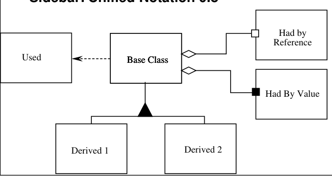
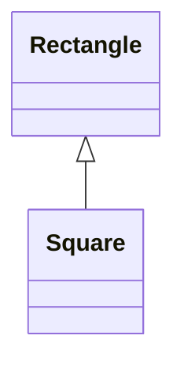
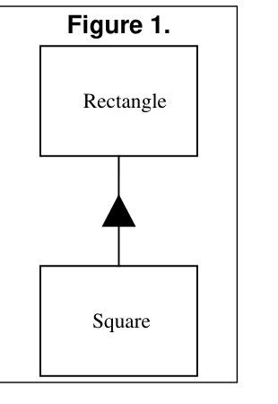
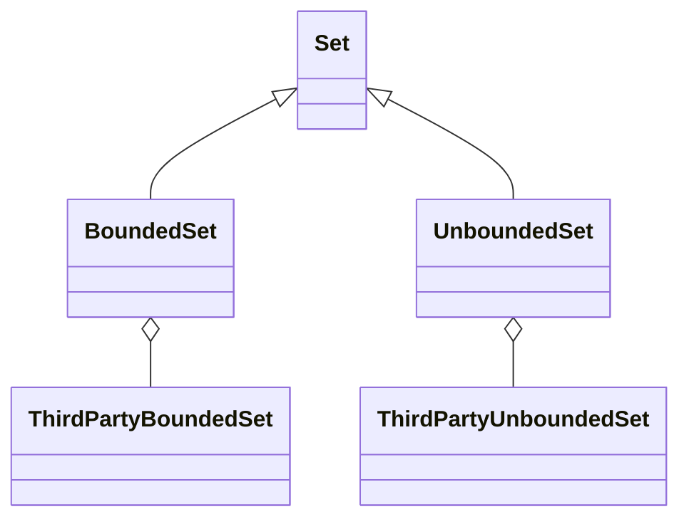
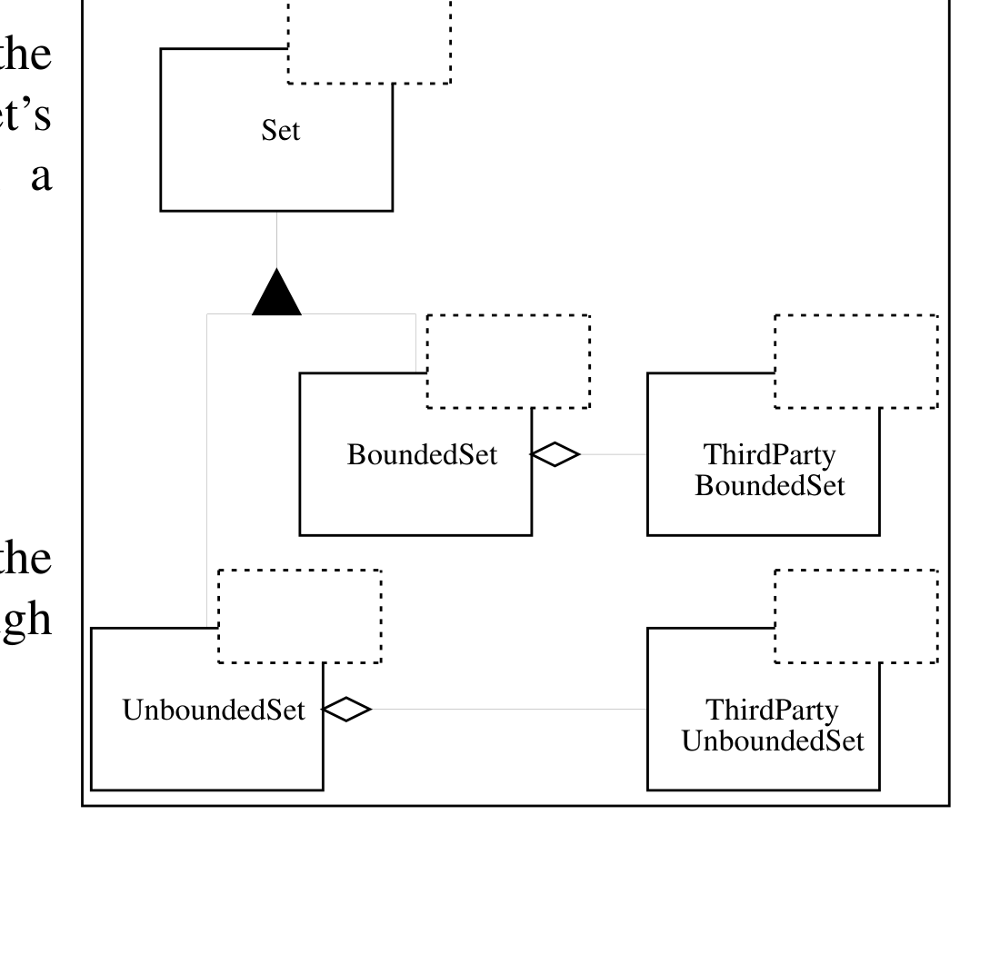
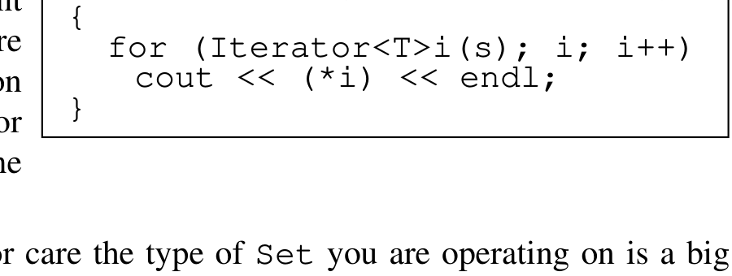
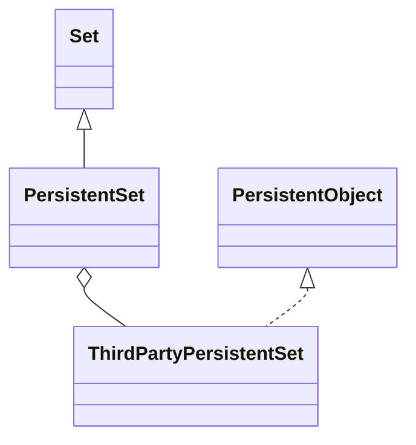
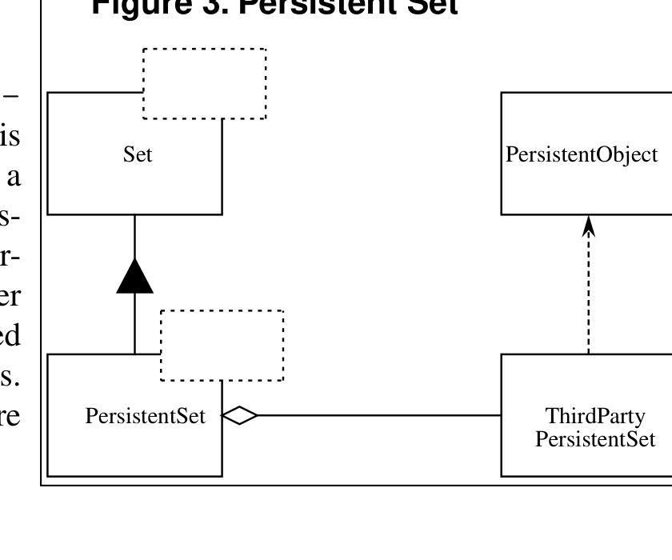
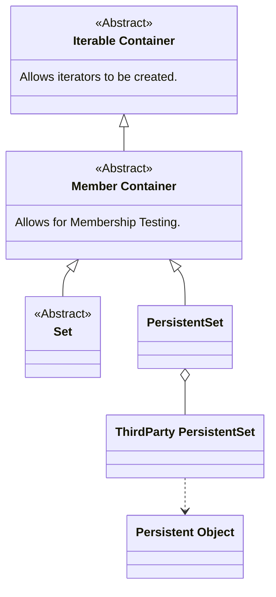
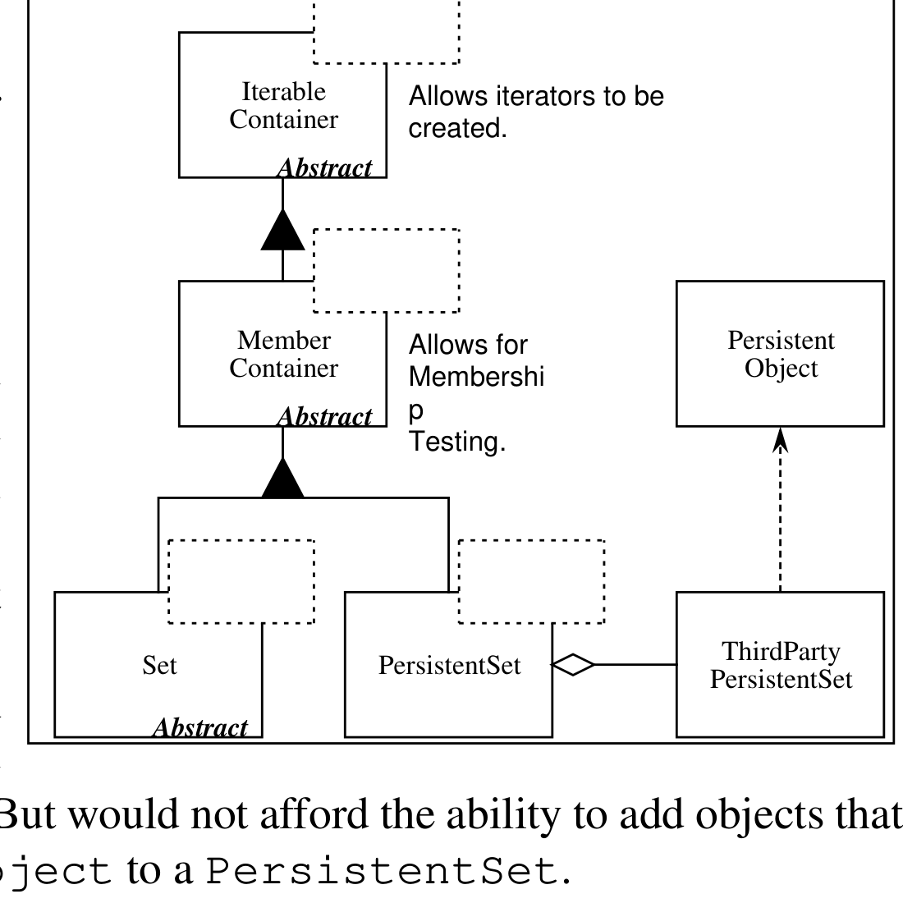

# The Liskov Substitution Principle

## Table of Contents

- [Introduction](#introduction)
- [The Liskov Substitution Principle](#the-liskov-substitution-principle)
  - [A Simple Example of a Violation of LSP](#a-simple-example-of-a-violation-of-lsp)
  - [Square and Rectangle, a More Subtle Violation.](#square-and-rectangle-a-more-subtle-violation)
  - [The Real Problem](#the-real-problem)
  - [Validity is not Intrinsic](#validity-is-not-intrinsic)
  - [What Went Wrong? (W³)](#what-went-wrong-w%C2%B3)
  - [Design by Contract](#design-by-contract)
- [A Real Example.](#a-real-example)
  - [Motivation](#motivation)
  - [Problem](#problem)
- [A Solution that does *not* conform to the LSP.](#a-solution-that-does-not-conform-to-the-lsp)
- [An LSP Compliant Solution](#an-lsp-compliant-solution)
- [Conclusion](#conclusion)

This is the second of my *Engineering Notebook* columns for *The C++ Report*. The articles that will appear in this column will focus on the use of C++ and OOD, and will address issues of software engineering. I will strive for articles that are pragmatic and directly useful to the software engineer in the trenches. In these articles I will make use of Booch's and Rumbaugh's new *unified* notation (Version 0.8) for documenting object oriented designs. The sidebar provides a brief lexicon of this notation.



*Sidebar: Unified Notation 0.8*

<details>
<summary>Image description</summary>

Sidebar: Unified Notation 0.8 — UML-style diagram showing a Base Class with a dashed "Used" arrow to a Used box, aggregation diamonds to "Had by Reference" and "Had By Value" boxes, and a generalization triangle to Derived 1 and Derived 2

</details>

## Introduction

My last column (Jan, 96) talked about the Open-Closed principle. This principle is the foundation for building code that is maintainable and reusable. It states that well designed code can be extended without modification; that in a well designed program new features are added by adding new code, rather than by changing old, already working, code.

The primary mechanisms behind the Open-Closed principle are abstraction and polymorphism. In statically typed languages like C++, one of the key mechanisms that supports abstraction and polymorphism is inheritance. It is by using inheritance that we can create derived classes that conform to the abstract polymorphic interfaces defined by pure virtual functions in abstract base classes.

What are the design rules that govern this particular use of inheritance? What are the characteristics of the best inheritance hierarchies? What are the traps that will cause us to create hierarchies that do not conform to the Open-Closed principle? These are the questions that this article will address.

# The Liskov Substitution Principle

*FUNCTIONS THAT USE POINTERS OR REFERENCES TO BASE CLASSES MUST BE ABLE TO USE OBJECTS OF DERIVED CLASSES WITHOUT KNOWING IT.*

The above is a paraphrase of the Liskov Substitution Principle (LSP). Barbara Liskov first wrote it as follows nearly 8 years ago\[^1\]:

> *What is wanted here is something like the following substitution property: If for each object $o_1$ of type S there is an object $o_2$ of type T such that for all programs P defined in terms of T, the behavior of P is unchanged when $o_1$ is substituted for $o_2$ then S is a subtype of T.*

The importance of this principle becomes obvious when you consider the consequences of violating it. If there is a function which does not conform to the LSP, then that function uses a pointer or reference to a base class, but must *know* about all the derivatives of that base class. Such a function violates the Open-Closed principle because it must be modified whenever a new derivative of the base class is created.

## A Simple Example of a Violation of LSP

One of the most glaring violations of this principle is the use of C++ Run-Time Type Information (RTTI) to select a function based upon the type of an object. i.e.:

```cpp
void DrawShape(const Shape& s)
{
  if (typeid(s) == typeid(Square))
    DrawSquare(static_cast<Square&>(s));
  else if (typeid(s) == typeid(Circle))
    DrawCircle(static_cast<Circle&>(s));
}
```

\[Note: `static_cast` is one of the new cast operators. In this example it works exactly like a regular cast. i.e. `DrawSquare((Square&)s);`. However the new syntax has more stringent rules that make is safer to use, and is easier to locate with tools such as grep. It is therefore preferred.\]

Clearly the `DrawShape` function is badly formed. It must know about every possible derivative of the `Shape` class, and it must be changed whenever new derivatives of `Shape` are created. Indeed, many view the structure of this function as anathema to Object Oriented Design.

\[^1\]: Barbara Liskov, "Data Abstraction and Hierarchy," *SIGPLAN Notices*, 23,5 (May, 1988).

## Square and Rectangle, a More Subtle Violation.

However, there are other, far more subtle, ways of violating the LSP. Consider an application which uses the `Rectangle` class as described below:

```cpp
class Rectangle
{
public:
  void   SetWidth(double w)  {itsWidth=w;}
  void   SetHeight(double h) {itsHeight=w;}
  double GetHeight() const   {return itsHeight;}
  double GetWidth() const    {return itsWidth;}
private:
  double itsWidth;
  double itsHeight;
};
```

Imagine that this application works well, and is installed in many sites. As is the case with all successful software, as its users' needs change, new functions are needed. Imagine that one day the users demand the ability to manipulate squares in addition to rectangles.



*UML class diagram showing Square inheriting from Rectangle (generalization arrow pointing up to Rectangle), labeled Figure 1.*

<details>
<summary>Original figure</summary>



*Figure 1.*

</details>

It is often said that, in C++, inheritance is the ISA relationship. In other words, if a new kind of object can be said to fulfill the ISA relationship with an old kind of object, then the class of the new object should be derived from the class of the old object.

Clearly, a square is a rectangle for all normal intents and purposes. Since the ISA relationship holds, it is logical to model the `Square` class as being derived from `Rectangle`. (See Figure 1.)

This use of the ISA relationship is considered by many to be one of the fundamental techniques of Object Oriented Analysis. A square is a rectangle, and so the `Square` class should be derived from the `Rectangle` class. However this kind of thinking can lead to some subtle, yet significant, problems. Generally these problem are not foreseen until we actually try to code the application.

Our first clue might be the fact that a `Square` does not need both `itsHeight` and `itsWidth` member variables. Yet it will inherit them anyway. Clearly this is wasteful. Moreover, if we are going to create hundreds of thousands of `Square` objects (e.g. a CAD/CAE program in which every pin of every component of a complex circuit is drawn as a square), this waste could be extremely significant.

However, let's assume that we are not very concerned with memory efficiency. Are there other problems? Indeed! `Square` will inherit the `SetWidth` and `SetHeight` functions. These functions are utterly inappropriate for a `Square`, since the width and height of a square are identical.". This should be a significant clue that there is a problem

with the design. However, there is a way to sidestep the problem. We could override `SetWidth` and `SetHeight` as follows:

```cpp
void Square::SetWidth(double w)
{
  Rectangle::SetWidth(w);
  Rectangle::SetHeight(w);
}

void Square::SetHeight(double h)
{
  Rectangle::SetHeight(h);
  Rectangle::SetWidth(h);
}
```

Now, when someone sets the width of a `Square` object, its height will change correspondingly. And when someone sets its height, the width will change with it. Thus, the invariants of the `Square` remain intact. The `Square` object will remain a mathematically proper square.

```cpp
Square s;
s.SetWidth(1);  // Fortunately sets the height to 1 too.
s.SetHeight(2); // sets width and heigt to 2, good thing.
```

But consider the following function:

```cpp
void f(Rectangle& r)
{
  r.SetWidth(32); // calls Rectangle::SetWidth
}
```

If we pass a reference to a `Square` object into this function, the `Square` object will be corrupted because the height won't be changed. This is a clear violation of LSP. The `f` function does not work for derivatives of its arguments. The reason for the failure is that `SetWidth` and `SetHeight` were not declared `virtual` in `Rectangle`.

We can fix this easily. However, when the creation of a derived class causes us to make changes to the base class, it often implies that the design is faulty. Indeed, it violates the Open-Closed principle. We might counter this with argument that forgetting to make `SetWidth` and `SetHeight` `virtual` was the real design flaw, and we are just fixing it now. However, this is hard to justify since setting the height and width of a rectangle are exceedingly primitive operations. By what reasoning would we make them `virtual` if we did not anticipate the existence of `Square`.

Still, let's assume that we accept the argument, and fix the classes. We wind up with the following code:

```cpp
class Rectangle
{
public:
  virtual void SetWidth(double w)  {itsWidth=w;}
  virtual void SetHeight(double h) {itsHeight=h;}
  double       GetHeight() const   {return itsHeight;}
  double       GetWidth() const    {return itsWidth;}
```

```cpp
private:
  double itsHeight;
  double itsWidth;
};
class Square : public Rectangle
{
public:
  virtual void SetWidth(double w);
  virtual void SetHeight(double h);
};

void Square::SetWidth(double w)
{
  Rectangle::SetWidth(w);
  Rectangle::SetHeight(w);
}

void Square::SetHeight(double h)
{
  Rectangle::SetHeight(h);
  Rectangle::SetWidth(h);
}
```

## The Real Problem

At this point in time we have two classes, `Square` and `Rectangle`, that appear to work. No matter what you do to a `Square` object, it will remain consistent with a mathematical square. And regardless of what you do to a `Rectangle` object, it will remain a mathematical rectangle. Moreover, you can pass a `Square` into a function that accepts a pointer or reference to a `Rectangle`, and the `Square` will still act like a square and will remain consistent.

Thus, we might conclude that the model is now self consistent, and correct. However, this conclusion would be amiss. A model that is self consistent is not necessarily consistent with all its users! Consider function `g` below.

```cpp
void g(Rectangle& r)
{
  r.SetWidth(5);
  r.SetHeight(4);
  assert(r.GetWidth() * r.GetHeight()) == 20);
}
```

This function invokes the `SetWidth` and `SetHeight` members of what it believes to be a `Rectangle`. The function works just fine for a `Rectangle`, but declares an assertion error if passed a `Square`. So here is the real problem: Was the programmer who wrote that function justified in assuming that *changing the width of a Rectangle leaves its height unchanged*?

Clearly, the programmer of `g` made this very reasonable assumption. Passing a `Square` to functions whose programmers made this assumption will result in problems. Therefore, there exist functions that take pointers or references to `Rectangle` objects,

but cannot operate properly upon `Square` objects. These functions expose a violation of the LSP. The addition of the `Square` derivative of `Rectangle` has broken these function; and so the Open-Closed principle has been violated.

## Validity is not Intrinsic

This leads us to a very important conclusion. A model, viewed in isolation, can not be meaningfully validated. The validity of a model can only be expressed in terms of its clients. For example, when we examined the final version of the `Square` and `Rectangle` classes in isolation, we found that they were self consistent and valid. Yet when we looked at them from the viewpoint of a programmer who made reasonable assumptions about the base class, the model broke down.

Thus, when considering whether a particular design is appropriate or not, one must not simply view the solution in isolation. One must view it in terms of the reasonable assumptions that will be made by the users of that design.

## What Went Wrong? (W³)

So what happened? Why did the apparently reasonable model of the `Square` and `Rectangle` go bad. After all, isn't a `Square` a `Rectangle`? Doesn't the ISA relationship hold?

No! A square might be a rectangle, but a `Square` object is definitely *not* a `Rectangle` object. Why? Because the *behavior* of a `Square` object is not consistent with the behavior of a `Rectangle` object. Behaviorally, a `Square` is not a `Rectangle`! And it is *behavior* that software is really all about.

The LSP makes clear that in OOD the ISA relationship pertains to *behavior*. Not intrinsic private behavior, but extrinsic public behavior; behavior that clients depend upon. For example, the author of function `g` above depended on the fact that `Rectangle`s behave such that their height and width vary independently of one another. That independence of the two variables is an extrinsic public behavior that other programmers are likely to depend upon.

In order for the LSP to hold, and with it the Open-Closed principle, all derivatives must conform to the behavior that clients expect of the base classes that they use.

## Design by Contract

There is a strong relationship between the LSP and the concept of Design by Contract as expounded by Bertrand Meyer². Using this scheme, methods of classes declare preconditions and postconditions. The preconditions must be true in order for the method to execute. Upon completion, the method guarantees that the postcondition will be true.

2. *Object Oriented Software Construction*, Bertrand Meyer, Prentice Hall, 1988

We can view the postcondition of `Rectangle::SetWidth(double w)` as:

```cpp
assert((itsWidth == w) && (itsHeight == old.itsHeight));
```

Now the rule for the preconditions and postconditions for derivatives, as stated by Meyer³, is:

> ...*when redefining a routine [in a derivative], you may only replace its precondition by a weaker one, and its postcondition by a stronger one.*

In other words, when using an object through its base class interface, the user knows only the preconditions and postconditions of the base class. Thus, derived objects must not expect such users to obey preconditions that are stronger then those required by the base class. That is, they must accept anything that the base class could accept. Also, derived classes must conform to all the postconditions of the base. That is, their behaviors and outputs must not violate any of the constraints established for the base class. Users of the base class must not be confused by the output of the derived class.

Clearly, the postcondition of `Square::SetWidth(double w)` is weaker than the postcondition of `Rectangle::SetWidth(double w)` above, since it does not conform to the base class clause "`(itsHeight == old.itsHeight)`". Thus, `Square::SetWidth(double w)` violates the contract of the base class.

Certain languages, like Eiffel, have direct support for preconditions and postconditions. You can actually declare them, and have the runtime system verify them for you. C++ does not have such a feature. Yet, even in C++ we can manually consider the preconditions and postconditions of each method, and make sure that Meyer's rule is not violated. Moreover, it can be very helpful to document these preconditions and postconditions in the comments for each method.

# A Real Example.



*UML class diagram showing Set as parent of BoundedSet and UnboundedSet via generalization, with ThirdPartyBoundedSet and ThirdPartyUnboundedSet linked by aggregation (diamond) to BoundedSet and UnboundedSet respectively.*

<details>
<summary>Original figure</summary>



*Figure 2: Container Hierarchy*

</details>

Enough of squares and rectangles! Does the LSP have a bearing on real software? Let's look at a case study that comes from a project that I worked on a few years ago.

## Motivation

I was unhappy with the interfaces of the container classes that were available through

3. *ibid*, p256

third parties. I did not want my application code to be horribly dependent upon these containers because I felt that I would want to replace them with better classes later. Thus I wrapped the third party containers in my own abstract interface. (See Figure 2)

I had an abstract class called `Set` which presented pure virtual `Add`, `Delete`, and `IsMember` functions.

```cpp
template <class T>
class Set
{
  public:
    virtual void Add(const T&) = 0;
    virtual void Delete(const T&) = 0;
    virtual bool IsMember(const T&) const = 0;
};
```

This structure unified the Unbounded and Bounded varieties of the two third party sets and allowed them to be accessed through a common interface. Thus some client could accept an argument of type `Set<T>&` and would not care whether the actual Set it worked on was of the Bounded or Unbounded variety. (See the `PrintSet` function listing.)



This ability to neither know nor care the type of `Set` you are operating on is a big advantage. It means that the programmer can decide which kind of `Set` is needed in each particular instance. None of the client functions will be affected by that decision. The programmer may choose a `BoundedSet` when memory is tight and speed is not critical, or the programmer may choose an `UnboundedSet` when memory is plentiful and speed is critical. The client functions will manipulate these objects through the interface of the base class `Set`, and will therefore not know or care which kind of `Set` they are using.

## Problem

I wanted to add a `PersistentSet` to this hierarchy. A persistent set is a set which can be written out to a stream, and then read back in later, possibly by a different application. Unfortunately, the only third party container that I had access to, that also offered persistence, was not a template class. Instead, it accepted objects that were



*UML class diagram showing PersistentSet inheriting from Set, an aggregation between PersistentSet and ThirdPartyPersistentSet, and ThirdPartyPersistentSet realizing PersistentObject, with unnamed dashed (interface/template) boxes attached to Set and PersistentSet.*

<details>
<summary>Original figure</summary>



*Figure 3. Persistent Set*

</details>

derived from the abstract base class `PersistentObject`. I created the hierarchy shown in Figure 3.

On the surface of it, this might look all right. However there is an implication that is rather ugly. When a client is adding members to the base class `Set`, how is that client supposed to ensure that it only adds derivatives of `PersistentObject` if the `Set` happens to be a `PersistentSet`?

Consider the code for `PersistentSet::Add`:

```cpp
template <class T>
void PersistentSet::Add(const T& t)
{
  PersistentObject& p =
    dynamic_cast<PersistentObject&>(t); // throw bad_cast
  itsThirdPartyPersistentSet.Add(p);
}
```

This code makes it clear that if any client tries to add an object that is not derived from the class `PersistentObject` to my `PersistentSet`, a runtime error will ensue. The `dynamic_cast` will throw `bad_cast` (one of the standard exception objects). None of the existing clients of the abstract base class `Set` expect exceptions to be thrown on `Add`. Since these functions will be confused by a derivative of `Set`, this change to the hierarchy violates the LSP.

Is this a problem? Certainly. Functions that never before failed when passed a derivative of `Set`, will now cause runtime errors when passed a `PersistentSet`. Debugging this kind of problem is relatively difficult since the runtime error occurs very far away from the actual logic flaw. The logic flaw is either the decision to pass a `PersistentSet` into the failed function, or it is the decision to add an object to the `PersistentSet` that is not derived from `PersistentObject`. In either case, the actual decision might be millions of instructions away from the actual invocation of the `Add` method. Finding it can be a bear. Fixing it can be worse.

# A Solution that does *not* conform to the LSP.

How do we solve this problem? Several years ago, I solved it by convention. Which is to say that I did not solve it in source code. Rather I instated a convention whereby `PersistentSet` and `PersistentObject` were not known to the application as a whole. They were only known to one particular module. This module was responsible for reading and writing all the containers. When a container needed to be written, its contents were copied into `PersistentObjects` and then added to `PersistentSets`, which were then saved on a stream. When a container needed to be read from a stream, the process was inverted. A `PersistentSet` was read from the stream, and then the `PersistentObjects` were removed from the `PersistentSet` and copied into regular (non-persistent) objects which were then added to a regular `Set`.

This solution may seem overly restrictive, but it was the only way I could think of to prevent `PersistentSet` objects from appearing at the interface of functions that would want to add non-persistent objects to them. Moreover it broke the dependency of the rest of the application upon the whole notion of persistence.

Did this solution work? Not really. The convention was violated in several parts of the application by engineers who did not understand the necessity for it. That is the problem with conventions, they have to be continually re-sold to each engineer. If the engineer does not agree, then the convention will be violated. And one violation ruins the whole structure.

# An LSP Compliant Solution

How would I solve this now? I would acknowledge that a `PersistentSet` does not have an ISA relationship with `Set`; that it is not a proper derivative of `Set`. Thus I would Separate the hierarchies. But not completely. There are features that `Set` and `PersistentSet` have in common. In fact, it is only the `Add` method that causes the difficulty with LSP. Thus I would create a hierarchy in which both `Set` and `PersistentSet` were siblings beneath an abstract interface that allowed for membership testing, iteration, etc. (See Figure 4.) This would allow `PersistentSet` objects to be Iterated and tested for membership, etc. But would not afford the ability to add objects that were not derived from `PersistentObject` to a `PersistentSet`.



*UML class diagram showing an inheritance hierarchy (Iterable Container -> Member Container -> Set and PersistentSet) with ThirdParty PersistentSet aggregating into PersistentSet and depending on Persistent Object.*

<details>
<summary>Original figure</summary>



*Figure 4: Separate Hierarchy*

</details>

```cpp
template <class T>
void PersistentSet::Add(const T& t)
{
  itsThirdPartyPersistentSet.Add(t);
  // This will generate a compiler error if t is
  // not derived from PersistentObject.
}
```

As the listing above shows, any attempt to add an object that is not derived from `PersistentObject` to a `PersistentSet` will result in a compilation error. (The interface of the third party persistent set expects a `PersistentObject&`).

# Conclusion

The Open-Closed principle is at the heart of many of the claims made for OOD. It is when this principle is in effect that applications are more maintainable, reusable and robust. The Liskov Substitution Principle (A.K.A Design by Contract) is an important feature of all programs that conform to the Open-Closed principle. It is only when derived types are completely substitutable for their base types that functions which use those base types can be reused with impunity, and the derived types can be changed with impunity.

This article is an extremely condensed version of a chapter from my new book: *Patterns and Advanced Principles of OOD*, to be published soon by Prentice Hall. In subsequent articles we will explore many of the other principles of object oriented design. We will also study various design patterns, and their strengths and weaknesses with regard to implementation in C++. We will study the role of Booch's class categories in C++, and their applicability as C++ namespaces. We will define what "cohesion" and "coupling" mean in an object oriented design, and we will develop metrics for measuring the quality of an object oriented design. And, after that, many other interesting topics.
