# The Dependency Inversion Principle

## Table of Contents

- [Introduction](#introduction)
- [What goes wrong with software?](#what-goes-wrong-with-software)
  - [The Definition of a "Bad Design"](#the-definition-of-a-bad-design)
  - [The Cause of "Bad Design".](#the-cause-of-bad-design)
  - [Example: the "Copy" program.](#example-the-copy-program)
- [Dependency Inversion](#dependency-inversion)
  - [Device Independence](#device-independence)
- [The Dependency Inversion Principle](#the-dependency-inversion-principle)
- [Layering](#layering)
- [Separating Interface from Implementation in C++](#separating-interface-from-implementation-in-c)
- [A Simple Example](#a-simple-example)
- [Finding the Underlying Abstraction](#finding-the-underlying-abstraction)
- [Extending the Abstraction Further](#extending-the-abstraction-further)
- [Conclusion](#conclusion)

This is the third of my *Engineering Notebook* columns for *The C++ Report*. The articles that will appear in this column will focus on the use of C++ and OOD, and will address issues of software engineering. I will strive for articles that are pragmatic and directly useful to the software engineer in the trenches. In these articles I will make use of Booch's and Rumbaugh's new *unified* notation (Version 0.8) for documenting object oriented designs. The sidebar provides a brief lexicon of this notation.

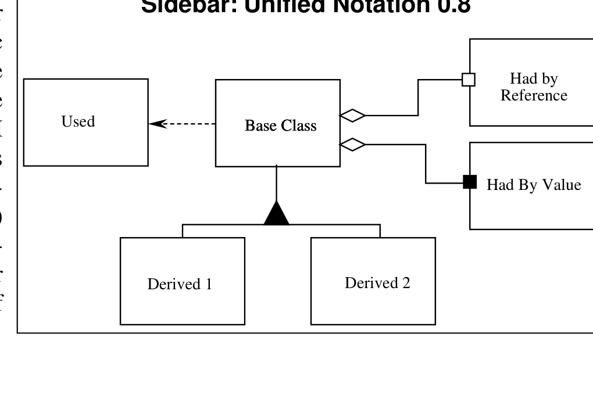

*Sidebar: Unified Notation 0.8*

<details>
<summary>Image description</summary>

Sidebar: Unified Notation 0.8 — diagram showing Base Class used by Derived 1 and Derived 2 via inheritance, Had by Reference, Had By Value, and Used relationships

</details>

## Introduction

My last article (Mar, 96) talked about the Liskov Substitution Principle (LSP). This principle, when applied to C++, provides guidance for the use of public inheritance. It states that every function which operates upon a reference or pointer to a base class, should be able to operate upon derivatives of that base class without knowing it. This means that the virtual member functions of derived classes must expect no more than the corresponding member functions of the base class; and should promise no less. It also means that virtual member functions that are present in base classes must also be present in the derived classes; and they must do useful work. When this principle is violated, the functions that operate upon pointers or references to base classes will need to check the type of the actual object to make sure that they can operate upon it properly. This need to check the type violates the Open-Closed Principle (OCP) that we discussed last January.

In this column, we discuss the structural implications of the OCP and the LSP. The structure that results from rigorous use of these principles can be generalized into a principle all by itself. I call it "The Dependency Inversion Principle" (DIP).

# What goes wrong with software?

Most of us have had the unpleasant experience of trying to deal with a piece of software that has a "bad design". Some of us have even had the much more unpleasant experience of discovering that we were the authors of the software with the "bad design". What is it that makes a design bad?

Most software engineers don't set out to create "bad designs". Yet most software eventually degrades to the point where someone will declare the design to be unsound. Why does this happen? Was the design poor to begin with, or did the design actually degrade like a piece of rotten meat? At the heart of this issue is our lack of a good working definition of "bad" design.

## The Definition of a "Bad Design"

Have you ever presented a software design, that you were especially proud of, for review by a peer? Did that peer say, in a whining derisive sneer, something like: "Why'd you do it *that* way?". Certainly this has happened to me, and I have seen it happen to many other engineers too. Clearly the disagreeing engineers are not using the same criteria for defining what "bad design" is. The most common criterion that I have seen used is the TNTWI-WHDI or "That's not the way I would have done it" criterion.

But there is one set of criteria that I think all engineers will agree with. A piece of software that fulfills its requirements and yet exhibits any or all of the following three traits has a bad design.

1. It is hard to change because every change affects too many other parts of the system. (Rigidity)
1. When you make a change, unexpected parts of the system break. (Fragility)
1. It is hard to reuse in another application because it cannot be disentangled from the current application. (Immobility)

Moreover, it would be difficult to demonstrate that a piece of software that exhibits none of those traits, i.e. it is flexible, robust, and reusable, and that also fulfills all its requirements, has a bad design. Thus, we can use these three traits as a way to unambiguously decide if a design is "good" or "bad".

## The Cause of "Bad Design".

What is it that makes a design rigid, fragile and immobile? It is the interdependence of the modules within that design. A design is rigid if it cannot be easily changed. Such rigidity is due to the fact that a single change to heavily interdependent software begins a cascade of changes in dependent modules. When the extent of that cascade of change cannot be

predicted by the designers or maintainers, the impact of the change cannot be estimated. This makes the cost of the change impossible to predict. Managers, faced with such unpredictability, become reluctant to authorize changes. Thus the design becomes officially rigid.

Fragility is the tendency of a program to break in many places when a single change is made. Often the new problems are in areas that have no conceptual relationship with the area that was changed. Such fragility greatly decreases the credibility of the design and maintenance organization. Users and managers are unable to predict the quality of their product. Simple changes to one part of the application lead to failures in other parts that appear to be completely unrelated. Fixing those problems leads to even more problems, and the maintenance process begins to resemble a dog chasing its tail.

A design is immobile when the desirable parts of the design are highly dependent upon other details that are not desired. Designers tasked with investigating the design to see if it can be reused in a different application may be impressed with how well the design would do in the new application. However if the design is highly interdependent, then those designers will also be daunted by the amount of work necessary to separate the desirable portion of the design from the other portions of the design that are undesirable. In most cases, such designs are not reused because the cost of the separation is deemed to be higher than the cost of redevelopment of the design.

## Example: the "Copy" program.

A simple example may help to make this point. Consider a simple program that is charged with the task of copying characters typed on a keyboard to a printer. Assume, furthermore, that the implementation platform does not have an operating system that supports device independence. We might conceive of a structure for this program that looks like Figure 1:

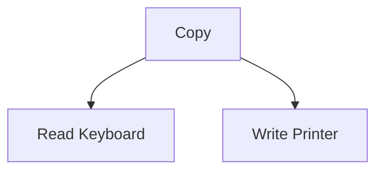

*A module hierarchy diagram showing a top-level 'Copy' module connected to two subprogram modules 'Read Keyboard' and 'Write Printer'.*

<details>
<summary>Original figure</summary>

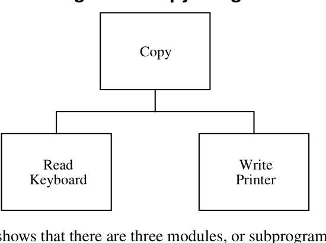

*Figure 1. Copy Program.*

</details>

Figure 1 is a "structure chart"[^1]. It shows that there are three modules, or subprograms, in the application. The "Copy" module calls the other two. One can easily imagine a loop within the "Copy" module. (See Listing 1.) The body of that loop calls the "Read Keyboard" module to fetch a character from the keyboard, it then sends that character to the "Write Printer" module which prints the character.

\[^1\]: See: *The Practical Guide To Structured Systems Design*, by Meilir Page-Jones, Yourdon Press, 1988

The two low level modules are nicely reusable. They can be used in many other programs to gain access to the keyboard and the printer. This is the same kind of reusability that we gain from subroutine libraries.

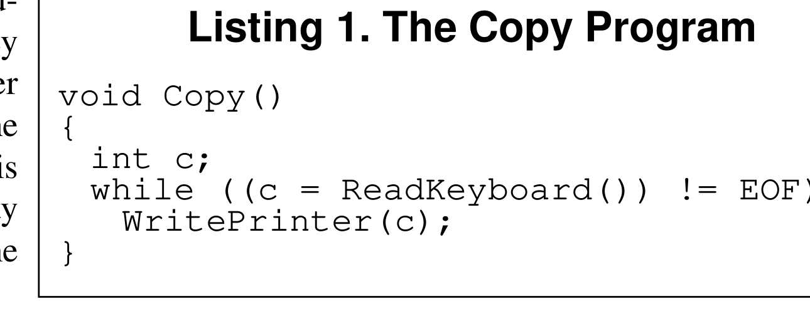

*Listing 1. The Copy Program*

However the "Copy" module is not reusable in any context which does not involve a keyboard or a printer. This is a shame since the intelligence of the system is maintained in this module. It is the "Copy" module that encapsulates a very interesting policy that we would like to reuse.

For example, consider a new program that copies keyboard characters to a disk file. Certainly we would like to reuse the "Copy" module since it encapsulates the high level policy that we need. i.e. it knows how to copy characters from a source to a sink. Unfortunately, the "Copy" module is dependent upon the "Write Printer" module, and so cannot be reused in the new context.

We could certainly modify the "Copy" module to give it the new desired functionality. (See Listing 2). We could add an 'if' statement to its policy and have it select between the "Write Printer" module and the "Write Disk" module depending upon some kind of flag. However this

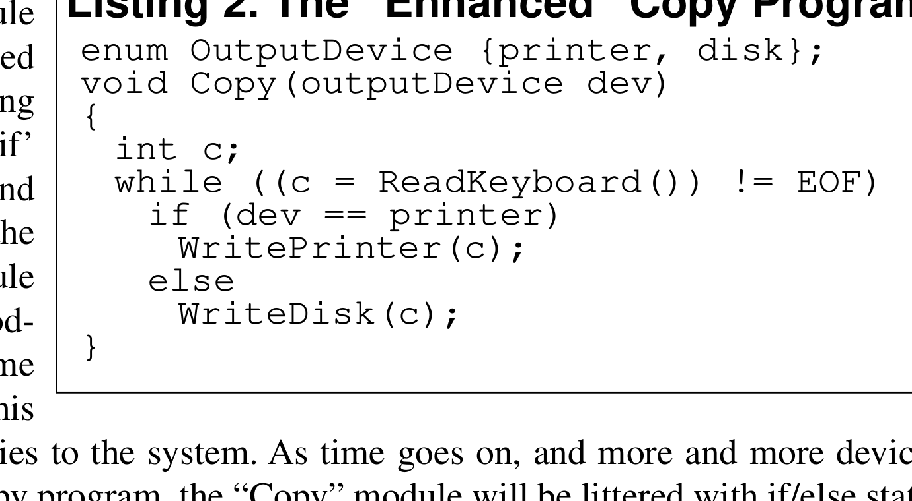

*Listing 2. The "Enhanced" Copy Program*

adds new interdependencies to the system. As time goes on, and more and more devices must participate in the copy program, the "Copy" module will be littered with if/else statements and will be dependent upon many lower level modules. It will eventually become rigid and fragile.

# Dependency Inversion

One way to characterize the problem above is to notice that the module containing the high level policy, i.e. the Copy() module, is dependent upon the low level detailed modules that it controls. (i.e. WritePrinter() and ReadKeyboard()). If we could find a way to make the Copy() module independent of the details that it controls, then we could reuse it freely. We could produce other programs which used this module to copy characters from any

input device to any output device. OOD gives us a mechanism for performing this *dependency inversion*.

Consider the simple class diagram in Figure 2. Here we have a "Copy" class which contains an abstract "Reader" class and an abstract "Writer" class. One can easily imagine a loop within the "Copy" class that gets characters from its "Reader" and sends them to its "Writer" (See Listing 3). Yet this "Copy" class does not depend upon the "Keyboard Reader" nor the "Printer Writer" at all. Thus the dependencies have been *inverted*; the "Copy" class depends upon abstractions, and the detailed readers and writers depend upon the same abstractions.

Now we can reuse the "Copy" class, independently of the "Keyboard Reader" and the "Printer Writer". We can invent new kinds of "Reader" and "Writer" derivatives that we can supply to the "Copy" class. Moreover, no matter how many kinds of "Readers" and "Writers" are created, "Copy" will depend upon none of them. There will be no interdependencies to make the program fragile or rigid. And Copy() itself can be used in many different detailed contexts. It is mobile.

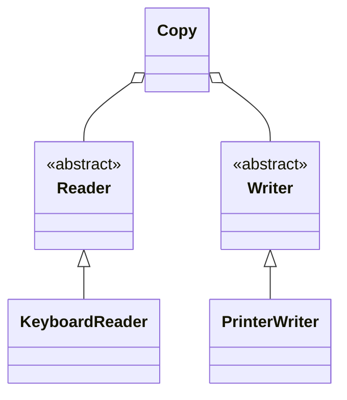

*UML class diagram of the OO Copy Program: Copy aggregates abstract Reader and Writer, with KeyboardReader and PrinterWriter as concrete subclasses.*

<details>
<summary>Original figure</summary>

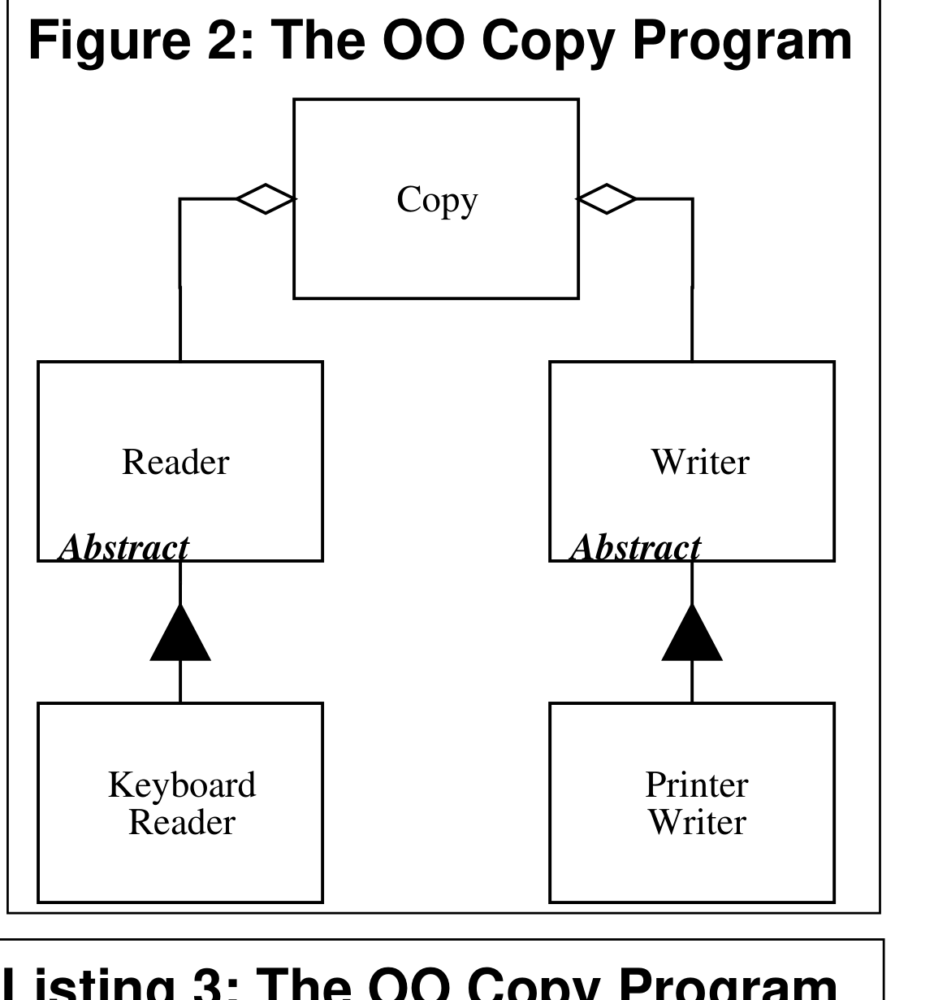

*Figure 2: The OO Copy Program*

</details>

**Listing 3: The OO Copy Program**

```cpp
class Reader
{
  public:
    virtual int Read() = 0;
};

class Writer
{
  public:
    virtual void Write(char) = 0;
};

void Copy(Reader& r, Writer& w)
{
  int c;
  while((c=r.Read()) != EOF)
    w.Write(c);
}
```

## Device Independence

By now, some of you are probably saying to yourselves that you could get the same benefits by writing Copy() in C, using the device independence inherent to `stdio.h`; i.e. `getchar` and `putchar` (See Listing 4). If you consider Listings 3 and 4 carefully, you will realize that the two are logically equivalent. The abstract classes in Figure 3 have been replaced by a different kind of abstraction in Listing 4. It is true that Listing 4 does not use classes and pure virtual functions, yet it still uses abstraction and polymorphism to achieve its ends. Moreover, it still uses dependency inversion! The Copy program in Listing 4 does not depend upon any of the details it controls. Rather it depends upon the abstract facilities

declared in `stdio.h`. Moreover, the IO drivers that are eventually invoked also depend upon the abstractions declared in `stdio.h`. Thus the device independence within the `stdio.h` library is another example of dependency inversion.

Now that we have seen a few examples, we can state the general form of the DIP.

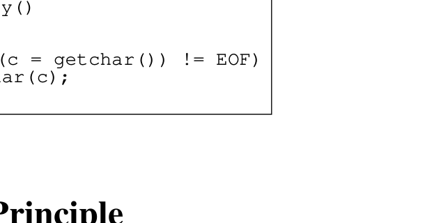

*Listing 4: Copy using stdio.h*

**Listing 4: Copy using `stdio.h`**

```c
#include <stdio.h>
void Copy()
{
  int c;
  while((c = getchar())  != EOF)
    putchar(c);
}
```

# The Dependency Inversion Principle

> A. *HIGH LEVEL MODULES SHOULD NOT DEPEND UPON LOW LEVEL MODULES.* **BOTH SHOULD DEPEND UPON ABSTRACTIONS.**
>
> B. *ABSTRACTIONS SHOULD NOT DEPEND UPON DETAILS.* **DETAILS SHOULD DEPEND UPON ABSTRACTIONS.**

One might question why I use the word "inversion". Frankly, it is because more traditional software development methods, such as Structured Analysis and Design, tend to create software structures in which high level modules depend upon low level modules, and in which abstractions depend upon details. Indeed one of the goals of these methods is to define the subprogram hierarchy that describes how the high level modules make calls to the low level modules. Figure 1 is a good example of such a hierarchy. Thus, the dependency structure of a well designed object oriented program is "inverted" with respect to the dependency structure that normally results from traditional procedural methods.

Consider the implications of high level modules that depend upon low level modules. It is the high level modules that contain the important policy decisions and business models of an application. It is these models that contain the identity of the application. Yet, when these modules depend upon the lower level modules, then changes to the lower level modules can have direct effects upon them; and can force them to change.

This predicament is absurd! It is the high level modules that ought to be forcing the low level modules to change. It is the high level modules that should take precedence over the lower level modules. High level modules simply should not depend upon low level modules in any way.

Moreover, it is high level modules that we want to be able to reuse. We are already quite good at reusing low level modules in the form of subroutine libraries. When high level modules depend upon low level modules, it becomes very difficult to reuse those high level modules in different contexts. However, when the high level modules are independent of the low level modules, then the high level modules can be reused quite simply.

This is the principle that is at the very heart of framework design.

# Layering

According to Booch^2^, "…all well structured object-oriented architectures have clearly-defined layers, with each layer providing some coherent set of services though a well-defined and controlled interface." A naive interpretation of this statement might lead a designer to produce a structure similar to Figure 3. In this diagram the high level policy class uses a lower level Mechanism; which in turn uses a detailed level utility class. While this may look appropriate, it has the insidious characteristic that the Policy Layer is sensitive to changes all the way down in the Utility Layer. *Dependency is transitive*. The Policy Layer depends upon something that depends upon the Utility Layer, thus the Policy Layer transitively depends upon the Utility Layer. This is very unfortunate.


*Figure 3 'Simple Layers': a flowchart showing the Policy Layer using the Mechanism Layer, which in turn uses the Utility Layer, connected by dashed arrows.*

<details>
<summary>Original figure</summary>

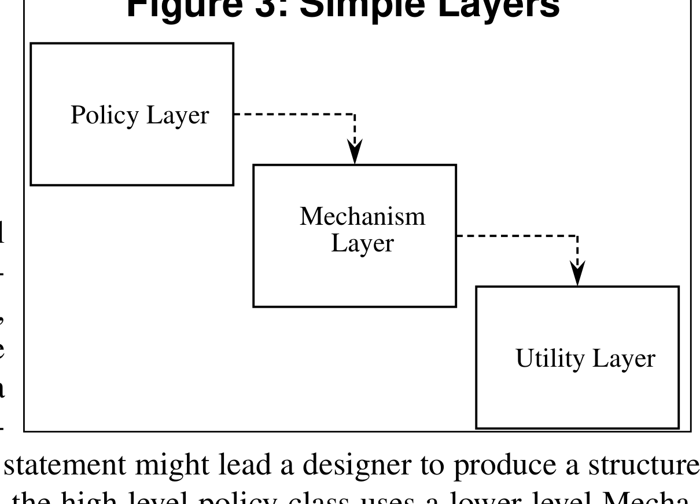

*Figure 3: Simple Layers*

</details>

Figure 3: Simple Layers

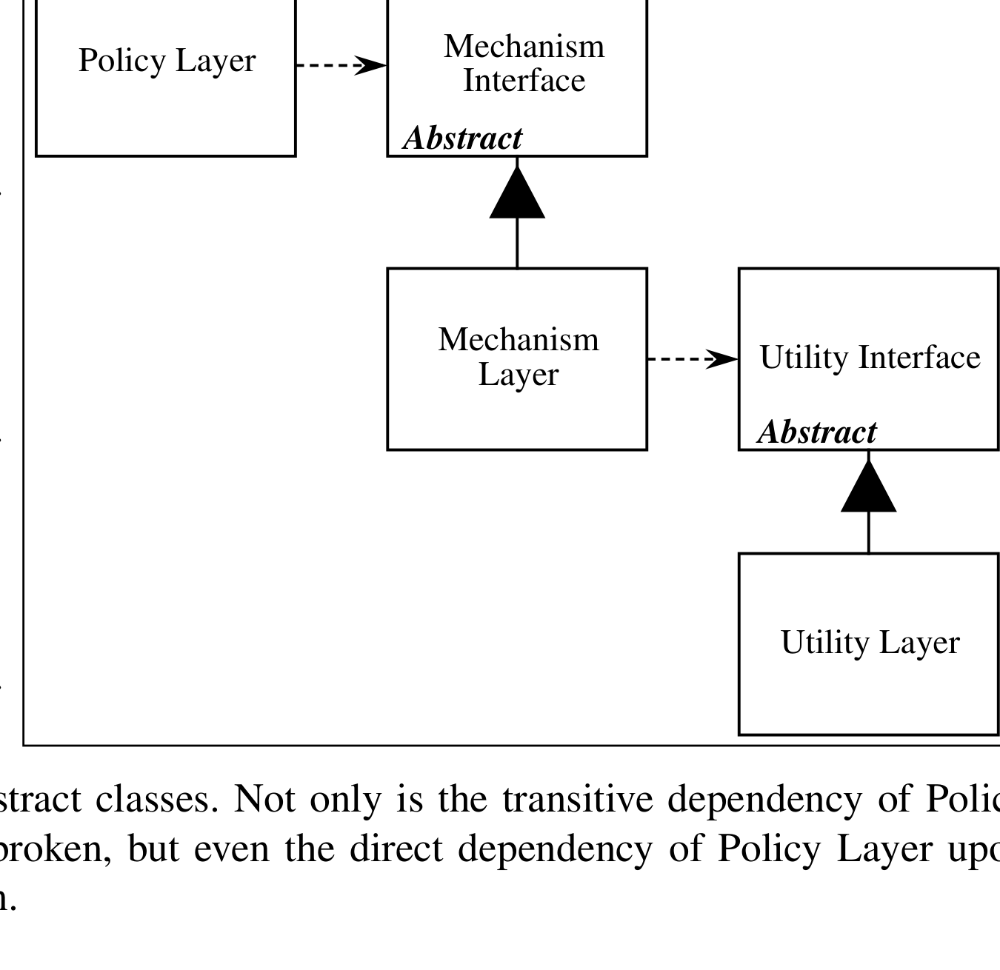

*Figure 4: Abstract Layers*

<details>
<summary>Image description</summary>

Figure 4: Abstract Layers — diagram of Policy Layer, Mechanism Interface (Abstract), Mechanism Layer, Utility Interface (Abstract), Utility Layer with dashed dependency and inheritance arrows

</details>

Figure 4 shows a more appropriate model. Each of the lower level layers are represented by an abstract class. The actual layers are then derived from these abstract classes. Each of the higher level classes uses the next lowest layer through the abstract interface. Thus, none of the layers depends upon any of the other layers. Instead, the layers depend upon abstract classes. Not only is the transitive dependency of Policy Layer upon Utility Layer broken, but even the direct dependency of Policy Layer upon Mechanism Layer is broken.

Figure 4: Abstract Layers

2. *Object Solutions*, Grady Booch, Addison Wesley, 1996, p54

Using this model, Policy Layer is unaffected by any changes to Mechanism Layer or Utility Layer. Moreover, Policy Layer can be reused in any context that defines lower level modules that conform to the Mechanism Layer interface. Thus, by inverting the dependencies, we have created a structure which is simultaneously more flexible, durable, and mobile.

# Separating Interface from Implementation in C++

One might complain that the structure in Figure 3 does not exhibit the dependency, and transitive dependency problems that I claimed. After all, Policy Layer depends only upon the *interface* of Mechanism Layer. Why would a change to the implementation of Mechanism Layer have any affect at all upon Policy Layer?

In some object oriented language, this would be true. In such languages, interface is separated from implementation automatically. In C++ however, there is no separation between interface and implementation. Rather, in C++, the separation is between the definition of the class and the definition of its member functions.

In C++ we generally separate a class into two modules: a `.h` module and a `.cc` module. The `.h` module contains the definition of the class, and the `.cc` module contains the definition of that class's member functions. The definition of a class, in the `.h` module, contains declarations of all the member functions and member variables of the class. This information goes beyond simple interface. All the utility functions and private variables needed by the class are also declared in the `.h` module. These utilities and private variables are part of the implementation of the class, yet they appear in the module that all users of the class must depend upon. Thus, in C++, implementation is not automatically separated from interface.

This lack of separation between interface and implementation in C++ can be dealt with by using purely abstract classes. A purely abstract class is a class that contains nothing but pure virtual functions. Such a class is pure interface; and its `.h` module contains no implementation. Figure 4 shows such a structure. The abstract classes in Figure 4 are meant to be purely abstract so that each of the layers depends only upon the *interface* of the subsequent layer.

# A Simple Example

Dependency Inversion can be applied wherever one class sends a message to another. For example, consider the case of the Button object and the Lamp object.

The Button object senses the external environment. It can determine whether or not a user has "pressed" it. It doesn't matter what the sensing mechanism is. It could be a button icon on a GUI, a physical button being pressed by a human finger, or even a motion detec-

tor in a home security system. The Button object detects that a user has either activated or deactivated it. The lamp object affects the external environment. Upon receiving a TurnOn message, it illuminates a light of some kind. Upon receiving a TurnOff message it extinguishes that light. The physical mechanism is unimportant. It could be an LED on a computer console, a mercury vapor lamp in a parking lot, or even the laser in a laser printer.

How can we design a system such that the Button object controls the Lamp object? Figure 5 shows a naive model. The Button object simply sends the TurnOn and TurnOff message to the Lamp. To facilitate this, the Button class uses a "contains" relationship to hold an instance of the Lamp class.

Listing 5 shows the C++ code that results from this model. Note that the Button class depends directly upon the Lamp class. In fact, the `button.cc` module `#include`s the `lamp.h` module. This dependency implies that the button class must change, or at very least be recompiled, whenever the Lamp class changes. Moreover, it will not be possible to reuse the Button class to control a Motor object.

Figure 5, and Listing 5 violate the dependency inversion principle. The high level policy of the application has not been separated from the low level modules; the abstractions have not been separated from the details. Without such a separation, the high level policy automatically depends upon the low level modules, and the abstractions automatically depend upon the details.


*Figure 5: Naive Button/Lamp Model — a Button object sends TurnOn and TurnOff messages to a Lamp object.*

<details>
<summary>Original figure</summary>

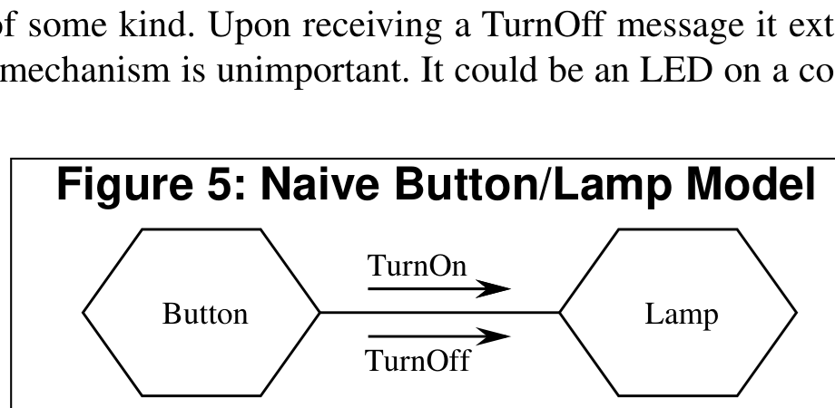

*Figure 5: Naive Button/Lamp Model*

<details>
<summary>Image description</summary>

Figure 5: Naive Button/Lamp Model — object diagram with Button and Lamp exchanging TurnOn/TurnOff messages, and class diagram showing Button containing Lamp

</details>
</details>

Figure 5: Naive Button/Lamp Model

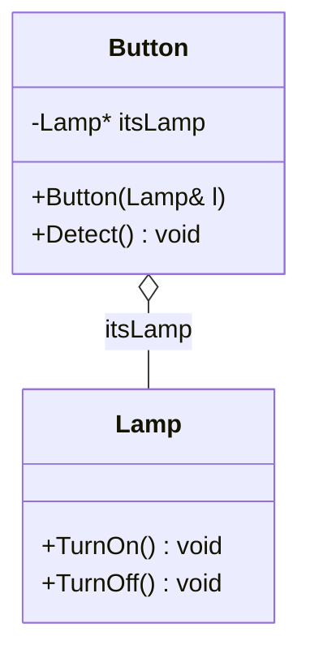

*UML class diagram showing Button aggregating a Lamp pointer, followed by the corresponding naive Button/Lamp C++ code listing.*

<details>
<summary>Original figure</summary>

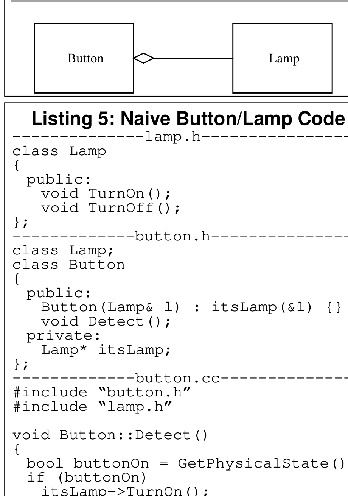

*Listing 5: Naive Button/Lamp Code*

</details>

**Listing 5: Naive Button/Lamp Code**

```c
--------------lamp.h--------------
class Lamp
{
  public:
    void TurnOn();
    void TurnOff();
};
-------------button.h-------------
class Lamp;
class Button
{
  public:
    Button(Lamp& l) : itsLamp(&l) {}
    void Detect();
  private:
    Lamp* itsLamp;
};
-------------button.cc------------
#include "button.h"
#include "lamp.h"

void Button::Detect()
{
  bool buttonOn = GetPhysicalState();
  if (buttonOn)
    itsLamp->TurnOn();
  else
    itsLamp->TurnOff();
}
```

# Finding the Underlying Abstraction

What is the high level policy? It is the abstractions that underlie the application, the truths that do not vary when the details are changed. In the Button/Lamp example, the underlying abstraction is to detect an on/off gesture from a user and relay that gesture to a target object. What mechanism is used to detect the user gesture? Irrelevant! What is the target object? Irrelevant! These are details that do not impact the abstraction.

To conform to the principle of dependency inversion, we must isolate this abstraction from the details of the problem. Then we must direct the dependencies of the design such that the details depend upon the abstractions. Figure 6 shows such a design.

In Figure 6, we have isolated the abstraction of the Button class, from its detailed implementation. Listing 6 shows the corresponding code. Note that the high level policy is entirely captured within the

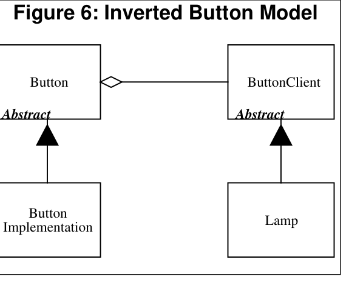

*Figure 6: Inverted Button Model*

Figure 6: Inverted Button Model

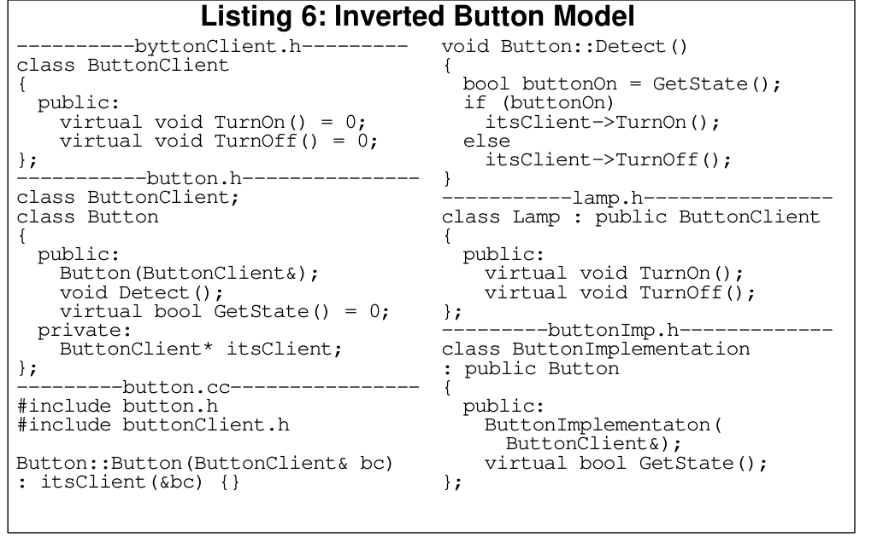

*Listing 6: Inverted Button Model*

**Listing 6: Inverted Button Model**

```c
----------byttonClient.h---------
class ButtonClient
{
  public:
    virtual void TurnOn() = 0;
    virtual void TurnOff() = 0;
};
-----------button.h---------------
class ButtonClient;
class Button
{
  public:
    Button(ButtonClient&);
    void Detect();
    virtual bool GetState() = 0;
  private:
    ButtonClient* itsClient;
};
---------button.cc----------------
#include button.h
#include buttonClient.h

Button::Button(ButtonClient& bc)
: itsClient(&bc) {}

void Button::Detect()
{
  bool buttonOn = GetState();
  if (buttonOn)
    itsClient->TurnOn();
  else
    itsClient->TurnOff();
}
-----------lamp.h----------------
class Lamp : public ButtonClient
{
  public:
    virtual void TurnOn();
    virtual void TurnOff();
};
---------buttonImp.h-------------
class ButtonImplementation
: public Button
{
  public:
    ButtonImplementaton(
      ButtonClient&);
    virtual bool GetState();
};
```

abstract button class[^3]. The Button class knows nothing of the physical mechanism for detecting the user's gestures; and it knows nothing at all about the lamp. Those details are isolated within the concrete derivatives: ButtonImplementation and Lamp.

The high level policy in Listing 6 is reusable with any kind of button, and with any kind of device that needs to be controlled. Moreover, it is not affected by changes to the low level mechanisms. Thus it is robust in the presence of change, flexible, and reusable.

# Extending the Abstraction Further

Once could make a legitimate complaint about the design in Figure/Listing 6. The device controlled by the button must be derived from ButtonClient. What if the Lamp class comes from a third party library, and we cannot modify the source code.

Figure 7 demonstrates how the Adapter pattern can be used to connect a third party Lamp object to the model. The LampAdapter class simply translates the TurnOn and TurnOff message inherited from ButtonClient, into whatever messages the Lamp class needs to see.

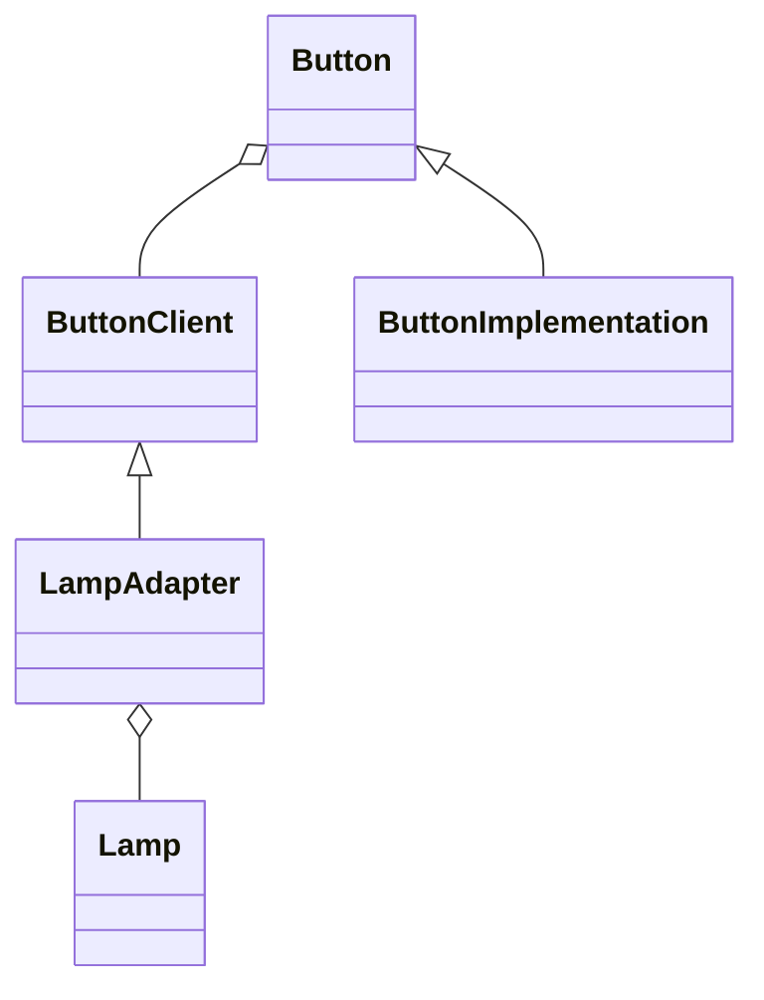

*A UML class diagram showing ButtonClient aggregating Button, LampAdapter aggregating Lamp, with Button Implementation extending Button and Lamp Adapter extending ButtonClient (Bridge pattern).*

<details>
<summary>Original figure</summary>

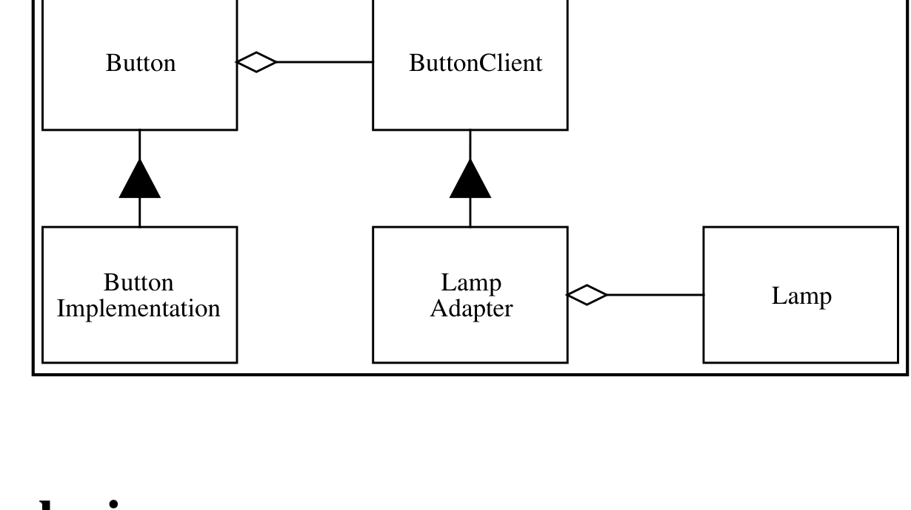

*Figure 7: Lamp Adapter*

<details>
<summary>Image description</summary>

UML class diagram: Button aggregates ButtonClient; ButtonImplementation inherits from Button; LampAdapter inherits from ButtonClient and aggregates Lamp

</details>
</details>

Figure 7: Lamp Adapter

# Conclusion

The principle of dependency inversion is at the root of many of the benefits claimed for object-oriented technology. Its proper application is necessary for the creation of reusable frameworks. It is also critically important for the construction of code that is resilient to

\[^3\]: Aficionados of Patterns will recognize the use of the Template Method pattern in the Button Hierarchy. The member function: Button::Detect() is the template that makes use of the pure virtual function: Button::GetState(). See: *Design Patterns*, Gamma, et. al., Addison Wesley, 1995

change. And, since the abstractions and details are all isolated from each other, the code is much easier to maintain.

This article is an extremely condensed version of a chapter from my new book: *Patterns and Advanced Principles of OOD*, to be published soon by Prentice Hall. In subsequent articles we will explore many of the other principles of object oriented design. We will also study various design patterns, and their strengths and weaknesses with regard to implementation in C++. We will study the role of Booch's class categories in C++, and their applicability as C++ namespaces. We will define what "cohesion" and "coupling" mean in an object oriented design, and we will develop metrics for measuring the quality of an object oriented design. And after that, we will discuss many other interesting topics.
