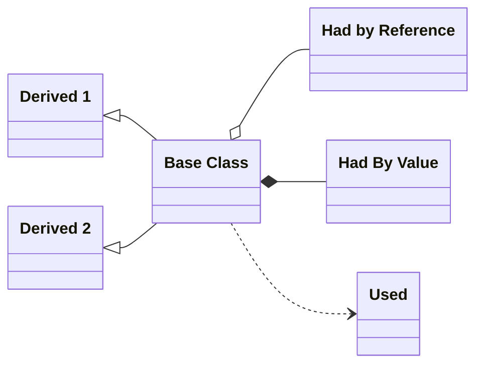
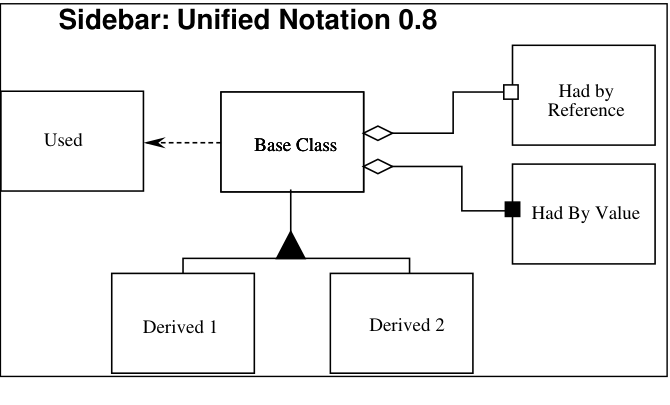
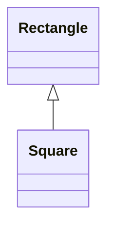
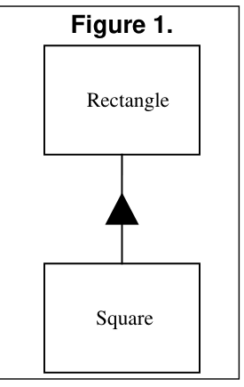

This is the second of my *Engineering Notebook* columns for *The C++ Report*. The articles that will appear in this column will focus on the use of C++ and OOD, and will address issues of software engineering. I will strive for articles that are pragmatic and directly useful to the software engineer in the trenches. In these articles I will make use of Booch's and Rumbaugh's new *unified* notation (Version 0.8) for documenting object oriented designs. The sidebar provides a brief lexicon of this notation.



*UML class diagram titled 'Sidebar: Unified Notation 0.8' showing a Base Class with two derived subclasses, an aggregation to 'Had by Reference', a composition to 'Had By Value', and a dashed dependency arrow to 'Used'.*

<details>
<summary>Original figure</summary>



*Sidebar: Unified Notation 0.8*

<details>
<summary>Image description</summary>

Sidebar: Unified Notation 0.8 diagram showing a Base Class with Used association, Had by Reference, Had By Value, and Derived 1 and Derived 2 subclasses

</details>
</details>

## Introduction

My last column (Jan, 96) talked about the Open-Closed principle. This principle is the foundation for building code that is maintainable and reusable. It states that well designed code can be extended without modification; that in a well designed program new features are added by adding new code, rather than by changing old, already working, code.

The primary mechanisms behind the Open-Closed principle are abstraction and polymorphism. In statically typed languages like C++, one of the key mechanisms that supports abstraction and polymorphism is inheritance. It is by using inheritance that we can create derived classes that conform to the abstract polymorphic interfaces defined by pure virtual functions in abstract base classes.

What are the design rules that govern this particular use of inheritance? What are the characteristics of the best inheritance hierarchies? What are the traps that will cause us to create hierarchies that do not conform to the Open-Closed principle? These are the questions that this article will address.

***F*UNCTIONS THAT USE POINTERS OR REFERENCES TO BASE CLASSES MUST BE ABLE TO USE OBJECTS OF DERIVED CLASSES WITHOUT KNOWING IT.**

The above is a paraphrase of the Liskov Substitution Principle (LSP). Barbara Liskov first wrote it as follows nearly 8 years ago<sup>1</sup>:

> *What is wanted here is something like the following substitution property: If for each object o*<sub>1</sub> *of type S there is an object o*<sub>2</sub> *of type T such that for all programs P defined in terms of T, the behavior of P is unchanged when o*<sub>1</sub> *is substituted for o*<sub>2</sub> *then S is a subtype of T.*

The importance of this principle becomes obvious when you consider the consequences of violating it. If there is a function which does not conform to the LSP, then that function uses a pointer or reference to a base class, but must *know* about all the derivatives of that base class. Such a function violates the Open-Closed principle because it must be modified whenever a new derivative of the base class is created.

## A Simple Example of a Violation of LSP

One of the most glaring violations of this principle is the use of C++ Run-Time Type Information (RTTI) to select a function based upon the type of an object. i.e.:

```cpp
void DrawShape(const Shape& s)
{
  if (typeid(s) == typeid(Square))
    DrawSquare(static_cast<Square&>(s));
  else if (typeid(s) == typeid(Circle))
    DrawCircle(static_cast<Circle&>(s));
}
```

\[Note: `static_cast` is one of the new cast operators. In this example it works exactly like a regular cast. i.e. `DrawSquare((Square&)s);`. However the new syntax has more stringent rules that make is safer to use, and is easier to locate with tools such as grep. It is therefore preferred.\]

Clearly the `DrawShape` function is badly formed. It must know about every possible derivative of the `Shape` class, and it must be changed whenever new derivatives of `Shape` are created. Indeed, many view the structure of this function as anathema to Object Oriented Design.

______________________________________________________________________

1. Barbara Liskov, "Data Abstraction and Hierarchy," *SIGPLAN Notices*, 23,5 (May, 1988).

# Square and Rectangle, a More Subtle Violation.

However, there are other, far more subtle, ways of violating the LSP. Consider an application which uses the `Rectangle` class as described below:

```cpp
class Rectangle
{
  public:
    void   SetWidth(double w)   {itsWidth=w;}
    void   SetHeight(double h)  {itsHeight=w;}
    double GetHeight() const    {return itsHeight;}
    double GetWidth() const     {return itsWidth;}
  private:
    double itsWidth;
    double itsHeight;
};
```

Imagine that this application works well, and is installed in many sites. As is the case with all successful software, as its users' needs change, new functions are needed. Imagine that one day the users demand the ability to manipulate squares in addition to rectangles.



*Figure 1: a UML inheritance diagram showing Square as a subclass of Rectangle (arrow with hollow triangle from Square to Rectangle).*

<details>
<summary>Original figure</summary>



*Figure 1.*

</details>

It is often said that, in C++, inheritance is the ISA relationship. In other words, if a new kind of object can be said to fulfill the ISA relationship with an old kind of object, then the class of the new object should be derived from the class of the old object.

Clearly, a square is a rectangle for all normal intents and purposes. Since the ISA relationship holds, it is logical to model the `Square` class as being derived from `Rectangle`. (See Figure 1.)

This use of the ISA relationship is considered by many to be one of the fundamental techniques of Object Oriented Analysis. A square is a rectangle, and so the `Square` class should be derived from the `Rectangle` class. However this kind of thinking can lead to some subtle, yet significant, problems. Generally these problem are not foreseen until we actually try to code the application.

Our first clue might be the fact that a `Square` does not need both `itsHeight` and `itsWidth` member variables. Yet it will inherit them anyway. Clearly this is wasteful. Moreover, if we are going to create hundreds of thousands of `Square` objects (e.g. a CAD/CAE program in which every pin of every component of a complex circuit is drawn as a square), this waste could be extremely significant.

However, let's assume that we are not very concerned with memory efficiency. Are there other problems? Indeed! `Square` will inherit the `SetWidth` and `SetHeight` functions. These functions are utterly inappropriate for a `Square`, since the width and height of a square are identical.". This should be a significant clue that there is a problem
